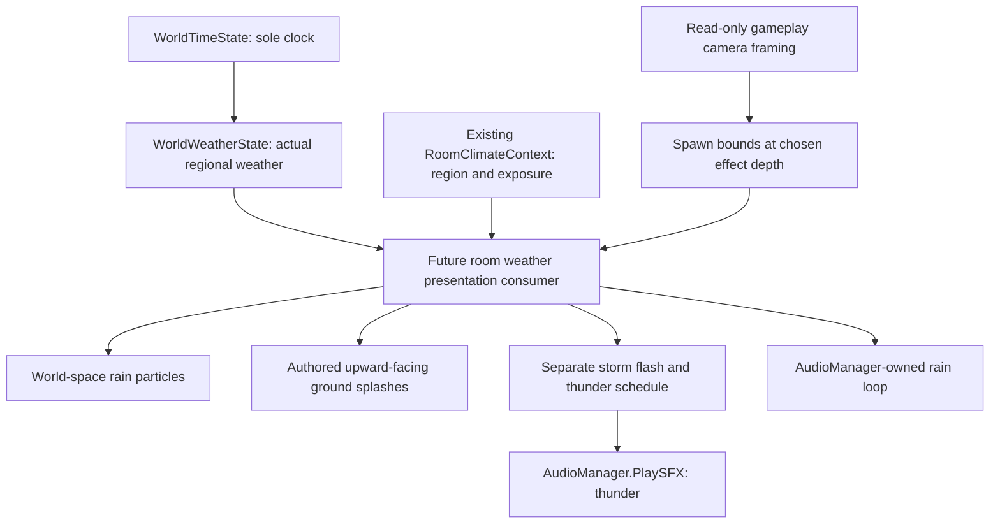

# Happy Harvest → Underbrew adaptation review

Inspection date: 2026-09-12. Status: inspection and provisional adaptation plan only; **not approval to implement Stage 4**.

## 1. Executive recommendation

**Happy Harvest is useful as a presentation reference, but this bundle is not a compatible drop-in weather system for Underbrew.** Retain the splash atlas and audio as content candidates. Reproduce selected rain, flash, and foliage techniques in small Underbrew-owned effects. Do not transplant the donor graphs or weather/audio architecture into gameplay.

The decisive compatibility finding contradicts the import manifest: current Underbrew uses URP **forward UniversalRendererData**, not Renderer2D, and does **not** declare Visual Effect Graph. Donor-path metadata/console responses were initially mistaken for live validation; that interpretation was withdrawn. They do not establish target compatibility.

The most useful findings are the layered rain idea, a six-frame splash atlas, particle color/alpha pulses for lightning, and camera-volume recycling for ambient particles. Important donor limitations include death-triggered rather than terrain-triggered splashes, ineffective exposed controls, scene-dependent sorting, and a sprite-lighting target that differs from Underbrew's renderer.

**First slice:** one restrained world-space rain particle layer with camera-following spawn coverage, a few authored ground splash emitters, a rain ambience loop, and a separate bounded storm flash plus thunder. Defer foreground rain, foliage wind, ambient particles, camera feedback, and a general shelter/collision framework until that slice is judged in motion.

### Evidence and scope

- **Confirmed** means traced in the imported files, actual target configuration/code, texture/audio data, or matching installed package implementation. It does not mean visually play-tested.
- **Recommendation** means the final synthesis after comparing the Luna findings against Underbrew ownership and rendering constraints.
- **Provisional visual judgment** means plausible art direction requiring Sam's review in the representative room.
- **Unresolved** means the available read-only evidence does not establish runtime or visual behavior.

The supplied `E:/GameDev/Projects/Final/_Project/Metroidvania Controller` directory does not exist on this machine. This report inspects the matching bundle in the active workspace, `E:/GameDev/Projects/Final_Project/Metroidvania Controller`.

Required context: [Architecture](../../../Docs/Architecture.md), [weather roadmap](../../../Docs/ImplementationPlans/WorldTimeClimateWeather.md), [weather contract](../../../Docs/FeatureSpecs/WorldTimeClimateWeather.md), [implementation status](../../../Docs/ImplementationPlan.md), [forensic report](WEATHER_ENVIRONMENT_FORENSIC_REPORT.md), and [import manifest](HappyHarvestEnvironmentManifest.md). The earlier report describes the original donor project; current imported assets and Underbrew code/configuration take precedence over its portability judgments.

Asset paths below are relative to `EnvironmentReference/HappyHarvest/` unless explicitly stated. Graph fileIDs are included where they distinguish connected behavior from unused slot defaults. Node inspection used serialized connection data and installed package source. Tool responses addressing the donor path did not establish a live donor graph inspection; the target instance was identified separately. **No VFX Graph window or rendered Underbrew weather preview was inspected.** No save, reimport, scene edit, package install, or production wiring was performed. Claims of clean import inferred from donor-path metadata or an unrelated console are excluded.

## 2. Asset decision matrix

Each root has one decision. KEEP permits ordinary content/import tuning; ADAPT would retain the underlying graph with meaningful edits; RECREATE retains the technique while making a new production implementation; DELETE means little standalone future value, **not an instruction to delete the quarantine copy now**. Confidence concerns the decision, not final visual quality.

| Asset | Decision | Confidence | Why | Required changes |
| ----- | -------- | ---------- | --- | ---------------- |
| `VFX/Rain/VFX_2DRain.vfx` | RECREATE | High | Layered rain is useful; no target VFX package, Sprite Lit output, lifetime splashes and ineffective color control make direct reuse unattractive. | Small ParticleSystem rain effect; explicit dimensions, direction, frustum-aware spawn coverage and target material; separate ground splashes. |
| `VFX/Rain/VFX_RainForeground.vfx` | RECREATE | High | Rain and flash techniques are useful; donor quad coverage, timing topology and output assumptions should not become production contracts. | Separate optional near rain from lightning; explicit storm scheduling and audio ownership; forward-compatible output. |
| `VFX/Rain/VFX_WaterDrop.vfx` | RECREATE | High | Useful localized drip/death-event example, but it does not find surfaces and has an ineffective Impact toggle. | Only if localized drips are later wanted: explicit source/landing anchors or a small known-surface effect. Not required for the first slice. |
| `VFX/Rain/2DwaterSplashFlipbook.shadergraph` | RECREATE | High | The atlas operation is tiny and valuable; retaining a donor Sprite Lit/VFX target adds little benefit in the current forward renderer. | Use ParticleSystem texture-sheet animation or a small compatible transparent atlas shader with frame range 0–5. |
| `VFX/Rain/RainSplashFlipbook.png` | KEEP | High technical; medium art | Self-contained six-frame splash content. Placement logic is external. | New production identity; review tint, scale, filtering and side-view silhouette. |
| `VFX/Rain/BlankSquare.png` | DELETE | High | Opaque white 256×256 square; no distinctive rain or flash artwork. | Use an existing compatible white texture/primitive in a recreated effect. Retain in quarantine while its reference graphs remain intact. |
| `VFX/Ambient Dust/VFX_DustParticles.vfx` | RECREATE | Medium | Recycled ambient-volume technique is useful; production should match the current renderer and explicit gameplay camera. | Reproduce only the needed mote behavior after the first slice, with correct perspective bounds and target material. |
| `VFX/Leaves/VFX_Leaves.vfx` | RECREATE | Medium | Leaf drift can be useful, but it is a distinct lifecycle/art effect and does not justify installing VFX Graph alone. | Separate lightweight leaf effect if the room's art direction needs it; explicit wind, bounds and fade behavior. |
| `ShaderGraphs/ShaderGraph_MoveVertices.shadergraph` | RECREATE | Medium | Retain directional, spatially varying vertex motion; simplify the donor transform stack and match forward rendering. | New compatible foliage shader with clear anchor/amplitude/phase controls and sprite/card validation. |
| `ShaderGraphs/Subgraphs/SubGraph_WaveSubGraph.shadersubgraph` | RECREATE | Medium | Noise/phase/height technique is useful; production interface should be small and explicit. | Small first-party wave function/subgraph; no donor reference. |
| `ShaderGraphs/Subgraphs/SubGraph_Transform.shadersubgraph` | RECREATE | Medium | Generic math is reference value; no reason to preserve a larger donor utility when the chosen bend needs fewer operations. | Implement only transformations actually required by the foliage effect. |
| `Materials/Material_Plants.mat` | RECREATE | High | Donor shader and tuning are not a target-ready foliage material. | Assign compatible production shader and actual foliage content; validate SpriteRenderer texture binding and mesh. |
| `Audio/Ambience/Rain.wav` | KEEP | High technical; medium audio | Ordinary stereo rain recording; no rendering dependency. | Review loop seam and mix; route through an AudioManager-owned ambience capability. |
| `Audio/Ambience/Thunder.wav` | KEEP | High technical; medium audio | Ordinary one-shot thunder recording. | Review loudness and fit; play through `AudioManager.PlaySFX`. |
| `Samples/Visual Effect Graph/17.0.3/OutputEvent Helpers/Runtime/VFXOutputEventPlayAudio.cs` | RECREATE | High | Direct AudioSource playback and sample dependency are unsuitable for Underbrew ownership. | Prefer presentation scheduler → AudioManager; only create an output-event adapter if a later VFX implementation actually needs one. |
| `VFX/Common/SpriteLitAlphaShadergraph.shadergraph` | RECREATE | High | Parent rain effects are being recreated; Sprite Lit target does not supply the target's forward-lighting behavior. | Use a compatible transparent particle material/shader; no automatic Light2D assumptions. |
| `VFX/Common/SpriteLitAdditiveShadergraph.shadergraph` | RECREATE | High | Same renderer mismatch; additive appearance is not appropriate for every ambient particle type. | Small target-compatible material if luminous motes need additive blending. |
| `VFX/Leaves/Leaf.png` | KEEP | Medium | Independent leaf content candidate; art fit remains provisional. | Production texture identity and visual review if leaves are commissioned. |

The matrix intentionally selects RECREATE over conditional “ADAPT or RECREATE”: for this small slice, the target has no VFX dependency to preserve and the useful parts are simple enough to reproduce. This is not a claim that VFX Graph cannot work in Underbrew.

## 3. Rain architecture recommendation

### Confirmed world rain mechanics

`VFX_2DRain.vfx` has a continuous spawn → initialize → update → planar output chain and a separate GPU-event splash system.

| Property | Imported graph evidence |
| --- | --- |
| Simulation | World space (`m_Space:1`); rain capacity 2000, data `8926484042661614568`. |
| Spawn | Position Shape block `8926484042661615349`, OrientedBox slot `...5350`: center `(0,0,0)`, size `(16,9,1)`, world-space slot. This is actual spawn geometry. |
| Rate/lifetime | Exposed `RainRate=1000`; unused inline rate fallback 1200. Lifetime random 0.5–1.0 s. At steady default rate this suggests roughly 500–1000 living drops before other effects/culling, not an observed count. |
| Velocity | `RainDirection=(0.05,-1,0)` is **Vector3**, multiplied by `RainSpeed=5` through `...4674`; random Set Velocity `...4569` uses that endpoint and hardcoded `(-3,-3,0)`. Only the first endpoint is speed-scaled. |
| Color | Exposed `RainColor=(1,1,1,0.73)` has no output links. It is not a working tint interface. |
| Shape/dimensions | Planar output, built-in particle texture. No explicit Set Size/Scale block or exposed streak dimensions was found in the main path. Do not assign a measured streak width/length from this inspection. |
| Output | Shared Sprite Lit Alpha graph, transparent/no depth write; serialized `receiveShadows:1` is not proof of correct target lighting. Output `...4614`: frustum culling enabled, sorting priorities 0. |
| Culling bounds | Initialize bounds `...4559`: center `(15,-4,0)`, size `(-85,52,1)`. These are **not spawn bounds**. Negative X is suspicious serialized metadata; runtime interpretation was not verified. |
| Camera coupling | A `(16,9,1)` Tile/Warp block `...5385` is on splash output `...5370`, not on primary rain. A sticky note does not establish a working camera-following primary emitter. |

The world rain direction parameter does not rotate a coherent velocity distribution. Underbrew should define a normalized direction plus speed and a small, intentional spread. Repeatedly copying hardcoded endpoint randomness would make wind control misleading.

### Recommended stack



All arrows out of simulation are consumption. No presentation callback chooses actual weather, advances time, or writes a simulation override. `GameManager` gains no weather responsibility. Camera framing is read-only input to presentation; weather simulation never references cameras.

- **World/background rain: yes.** Start with one narrow band behind the important gameplay silhouettes. Spawn coverage follows the gameplay camera, while already emitted particles continue in world space. Camera following and simulation space are separate choices.
- **Foreground rain: optional, initially off.** If needed later, use a sparse near band with low alpha and a strict screen-coverage budget. Do not inherit donor Foreground/order 90. Underbrew's layer order places Player/Enemy after Foreground; decide the intended relation deliberately and exclude the HUD.
- **Perspective bounds:** use the gameplay camera's frustum intersection at each chosen rain Z plane. For a perpendicular plane at camera distance `d`, half-height is `d*tan(verticalFOV/2)` and half-width is that times aspect. General rotated views need plane/frustum intersection. Add a margin for camera travel, maximum streak length, wind drift and lifetime. Do not reuse orthographic 16×9 constants, a negative culling extent, or the HUD camera.
- **Depth/parallax:** a world-space flag alone provides neither. Deliberately separated Z bands and stationary world-space trajectories produce perspective depth as the camera moves. A narrow first band is enough; add a second only if the visual benefit is clear. Sorting layers control draw order, not physical parallax.
- **Readability:** prefer narrow streaks, modest contrast, and limited near-camera coverage. Dense large foreground quads can obscure platform edges, enemy tells and projectiles. Final density is a visual judgment, not a donor preset.

Minimum future controls: overall intensity/emission, direction, speed, controlled spread, streak width/length, tint/opacity, lifetime, chosen depth and spawn coverage. Keep optional foreground opacity/rate separate. Ground splash rate should scale with rain presentation, not be inferred from arbitrary particle deaths. Do not expose ineffective donor controls just for parity.

## 4. Storm/lightning findings

### Rain branch and the calm/storm difference

`VFX_RainForeground.vfx` exposes `RainSpeed=5`, Vector3 `RainDirection=(0.05,-1,0)`, `RainTintColor=(0,0,0,0)`, `RainRate=1000`, and `Lightnings=false`. Its standalone tint default is transparent black; scene overrides matter. Rain is world-space, capacity 2000, with random lifetime 0.5–2.0 s. Its actual position shape is a unit oriented box, not a camera-sized viewport. Random output XY scale runs `(0.5,3)` to `(1,6)` on `BlankSquare.png`; final pixel dimensions depend on particle size and projection. The velocity range includes a hardcoded `(-3,-3,0)` endpoint, so its direction control also needs redesign rather than blind reuse.

The earlier forensic scene evidence reports calm and storm instances using the same graph and the same RainSpeed 6 / RainRate 1000 overrides, with `Lightnings=true` and an audio helper on the storm instance. Those donor scene configurations were not imported. The graph itself confirms **Lightnings does not increase rain rate or speed**. Sorting layer Foreground/order 90 is scene/component authoring from that report, not embedded graph sorting; graph output priorities are 0.

### Confirmed flash chain

- `System Thunder` Spawn context `8926484042661615029` feeds flash Initialize `...5049` and a separate Spawn context `...5969`.
- `Lightnings` slot `...5937` connects to the `_vfx_enabled` slot `...5932` of burst block `...5929`. It gates that **burst block**, not the entire graph.
- Installed `VFXSpawnerBurst` source maps `repeat:1` to Periodic. The block requests random count **5–10**, with random delay **4–8 seconds**. The flash data `...5063` has capacity **1**: the requested count is not five to ten simultaneous visible lightning bolts.
- Flash initialization is local-space, position `(0,0,0)`, lifetime **0.33–0.6 seconds**.
- Output `...5214` is a planar quad using `BlankSquare.png`, no Shader Graph, scalar size **30** from block `...5219`, and frustum culling disabled. It is a large particle, **not a true fullscreen pass**. Camera projection and its transform determine coverage.
- Color block `...5941` supplies an HDR gradient: white `(2,2,2)` at normalized age 0 to grey `(0.5,0.5,0.5)` at 1. Alpha keys are approximately `(0,0)`, `(.047,1)`, `(.171,1)`, `(.268,.071)`, `(.462,1)`, `(.997,0)`. These create a short multipulse flash independently of rain tint.
- No Light2D, scene-light intensity change, Volume change, camera shake, or gameplay behavior is produced by this graph. A bright quad can cover the scene without lighting its objects.

### Thunder topology and timing interpretation

The downstream Spawn context `...5969` contains burst `...5971`: Single (`repeat:0`), constant count 1, random delay **0–0.2 seconds**. Its output is `VFXOutputEvent` context `...5967`, named exactly **Thunder**. It is not a collision event and it is not scheduled by donor C#.

The installed 17.3 package's `Documentation~/Context-Spawn.md` explicitly documents chaining a SpawnEvent output into another Spawn context's Start input, transferring event attributes; implicit OnPlay applies only to an **unconnected** Start. Combined with the linked graph and periodic-burst source, the supported static interpretation is **periodic upstream emission starts the downstream one-shot, then Thunder follows after its additional 0–0.2-second delay**. It is not justified to conclude “only one thunder at graph startup” from `repeat:0`: that setting belongs to a retriggerable downstream spawner, not the upstream periodic stream. That agent interpretation is rejected.

This resolves the intended audiovisual relationship from graph topology and package semantics, not a live event-count trace. Lightnings gates the upstream periodic emission that drives the chain; it is not a global mute switch and does not prove immediate cancellation of an already-started delayed event. Exact event multiplicity with a requested 5–10 upstream particles, capacity-1 visual storage, and changes to the toggle during a pending delay remain unobserved execution details. Production should make those policies explicit rather than copy them.

### Underbrew recommendation

**Recreate the technique with explicit timing.** A small presentation-owned storm schedule creates a flash envelope and a related delayed thunder request. Its transient timer selects audiovisual variation only; it does not become another world clock or weather generator. One schedule establishes the relation between the flash and thunder, with cancellation/reset rules on room unload, exposure change and leaving Storm.

Separate responsibilities:

| Concern | Future owner and first-slice scope |
| --- | --- |
| Lightning visual | Presentation-owned restrained flash geometry/material compatible with forward URP, fitted to the gameplay view. Avoid unbounded full-white screen pulses. |
| Lightning timing | Small local presentation timer while actual weather is Storm; explicit cadence and variation. |
| Thunder timing/event | Same presentation schedule supplies an intentional delay; `AudioManager.PlaySFX` plays the one-shot. No donor helper. |
| Camera feedback | Omit from first slice. If later approved, send an explicit presentation request through established camera facilities; never embed shake in a VFX graph. |
| Lighting/environment flash | Optional later look improvement through the single presentation writer and the actual forward-rendering setup. Do not add competing writers to existing light/exposure state. |

The donor's 4–8 second cadence and high-contrast multipulse envelope are reference values, not recommended Underbrew defaults. Sam should judge a restrained prototype in combat and traversal.

## 5. Splash recommendation

### Confirmed chains

Both rain graphs examined here use Trigger Event `mode:3`, mapped by installed package source to **On Die**. They do not use Physics2D collision, terrain layers, surface normals or walkable-surface detection.

```text
drop reaches end of lifetime
    → On Die GPU event
    → splash initialize inherits source particle position
    → short-lived splash quad / atlas animation
```

In `VFX_2DRain`, splash capacity is 1000, lifetime 0.5–0.7 seconds, random scale `(4,4,1)`–`(5,5,1)`, and size 0.05–0.1. The splash output has the Tile/Warp block discussed above and uses the custom splash shader. Lifetime-based endpoints approximate scattered impacts on a flat donor composition; they do not solve side-view platforms.

`VFX_WaterDrop` is genuinely localized: Set Position `...4713` randomizes between `(-0.02,0,0)` and `(0.02,0,0)`. The much larger AABox centered about `(-0.0087,1.4014,-0.0185)` with size `(3.005,3.960,3.061)` is culling metadata, not a spawn volume. Drop capacity is 6, world-space; rate is authored as 1 with serialized spawn repeat-delay range 0.05–0.5 seconds. The exact effective cadence was not measured. Gravity `(0,-9.81,0)` and the wind path affect the fall. Drop output XY scale is randomized `(0.25,1)`–`(0.75,3)` with a built-in texture, transparent output and frustum culling disabled.

WaterDrop controls:

| Exposed control | Default and function |
| --- | --- |
| `Lifetime` | 0.59 seconds, connected; inline 0.65 fallback is not the effective exposed default. |
| `RainTintColor` | `(0.8565787,1,0.759434,0.7294118)`, connected to drop color. |
| `ImpactColor` | Same default, connected to splash color/alpha. |
| `Impact Size Range` | `(0.07,0.3)`, connected. |
| `Impact` | True, but output links to fileID 0; not an effective splash-disable switch. |
| `Wind Directio` | Authored misspelling; `(0.2,0,0)`, connected wind path. |
| `Wind Speed` | 1.5, connected wind path. |

On Die block `...4856` sends count 1 with clamp-to-one enabled to GPU event `...4660` → impact Initialize `...4629`. Impact capacity is 2, world-space, lifetime 0.3–0.5 seconds. Its built-in texture-sheet animation is 3×2 with a TexIndex curve 0→6. Six valid cells are indices 0–5; terminal-frame handling needs visual verification, particularly near particle death. This is not proof of a visible defect.

### Atlas and shader

`RainSplashFlipbook.png` is **384×256**, six **128×128** cells. Import settings are bilinear, clamp, no mipmaps, unsliced. Alpha analysis confirms distinct splash stages and a nearly transparent final cell; fine visual shape was difficult to judge against the image viewer's white background. Content fit remains provisional.

`2DwaterSplashFlipbook.shadergraph` exposes `flipbookTex` and `FrameIndex`. Its Flipbook node uses **3×2** with Y inversion; sampled RGB/alpha feed the Sprite Lit surface. It contains no surface-placement logic or special lighting algorithm. The atlas math can be reproduced nearly unchanged; the shader target should match Underbrew's forward renderer. ParticleSystem texture-sheet animation may remove the need for a custom splash shader altogether.

### First use on side-view surfaces

Keep the atlas. Place a few small emitters on authored, exposed, upward-facing ground/platform tops in the chosen room. Anchor each splash's base to the surface with a small art offset; render in the intended XY-facing plane, rather than laying a top-down quad across the ground. Scale emission with rain intensity and stop emission when Clear, letting existing particles finish briefly.

Only author emitters on surfaces that should receive rain. This avoids ceilings, walls and covered ledges without a universal collision service. The first room should have simple exposed terrain; do not imply room-level `Outdoor` alone masks a roof inside that room. If later content justifies procedural placement, use a bounded downward Physics2D probe that accepts upward normals and explicit exposure/terrain filtering. Do not introduce per-drop collider queries, screen-relative fake floor splashes, or a general precipitation collision framework for the first slice.

## 6. Ambient atmosphere recommendation

### Dust: fixed camera-near wrapping volume

`VFX_DustParticles.vfx` has world-space simulation, capacity **1500**, constant emission with exposed `SpawnRate=8000`, random lifetime 3–10 seconds, and initial velocity approximately `(-0.1,-0.1,0)` to `(0.1,-0.3,0)`. The high requested rate does not mean 80,000 living particles: capacity constrains storage. `EffectSizeMultiplier=1.4` scales a hardcoded `(16,9,0.1)` spawn/wrap volume to `(22.4,12.6,0.14)`. Its center is camera position plus camera-transform-applied offset `(0,0,2)`, using the implicit **MainCamera operator**, not an exposed camera reference. This is camera-bound placement, **not a camera-frustum calculation**.

The package TileWarp operation is:

```text
halfSize = size * 0.5
delta = (position - center) + halfSize
wrappedPosition = center + frac(delta / size) * size - halfSize
```

It recycles rendered position modulo the volume, independently on each axis. The block is applied in output and rewrites output position; **simulation position and velocity are not wrapped**. Particles continue simulating while their displayed positions appear within the camera-centered tile. A wrap can cross a visible edge or depth seam unless its bounds extend beyond the view. It also does not replace particles lost to lifetime expiry: emission, lifetime and capacity still matter.

Output faces the camera plane, uses random size **0.05–0.1**, additive Sprite Lit shading, frustum culling and sorting (`sort:1`). Both sorting priorities and sortMode serialize as 0. Exposed `ColorGradient` and `Alpha=0.5` control appearance; `ActivateTurbulence=false` gates optional turbulence. Turbulence has drag 0.25, random intensity 0–0.5, random frequency 1–3, one octave, roughness 0.5 and lacunarity 2 with identity world field transform; the random operators have serialized seeds 85 and 16. There is no confirmed general wind direction/speed interface equivalent to Leaves; add only the drift control a future mote effect needs.

**Missing dependency:** Dust and its additive shader reference GUID `c7e4a7133e6889544ac0e1fd0d1202e6`, identified in the original donor as `VFX/Common/shadow_circle.png`. A target-wide metadata search found no matching asset in Assets/Packages/ProjectSettings. The manifest's dependency-closure claim is therefore false for Dust. A file in a separate donor project does not automatically resolve a target AssetDatabase reference. Do not import that file during this pass; a recreated mote effect can use an existing suitable first-party texture instead.

For Underbrew, the fixed box just two units in front of a perspective camera is especially unsuitable as a default: its apparent size is governed by that depth, and its very thin Z extent provides little genuine depth distribution. Reproduce the wrapping concept at an explicit depth with correct frustum coverage, modest density, edge margins and a compatible texture/material. Do not carry over 8000 particles/second or infer a performance budget from that donor default.

### Leaves: local emitter, not wrapped atmosphere

`VFX_Leaves.vfx` has **local-space simulation**, capacity **10**, Constant Rate `Spawn Rate=0.5` plus a periodic burst of count 1 with random delay 0.5–1.5 seconds. It initializes inside a local circular spawn volume with `Spawn Radius=0.5`; exposed `Wind Direction=(1,0,0)` and `Wind Speed=0.1` drive initial motion. Lifetime is 1–1.5 seconds, angle random 0–180 degrees; inspected angular velocity is zero. Update adds gravity `(0,-0.5,0)` and enabled Value-noise turbulence in Relative mode: intensity 1, drag 0.7, frequency 2, one octave, roughness 0.5, lacunarity 2, identity local field transform. Existing particles follow movement of the emitter transform because the simulation is local.

Its textured planar output uses `Leaf.png`, no Shader Graph (built-in unlit output), additive blending, alpha-over-life, color adjustment, random size **0.1–0.25** and frustum culling. Per-particle sort is off (`sort:0`); both sorting priorities and sortMode are 0. Orientation is Along Velocity with ZY axis configuration; this is an art/orientation choice to retune for an XY side view. It contains **no TileWarp and no camera-bound volume**. Actual renderer sorting must be authored in Underbrew; the graph is not a portable foreground sorting configuration.

The agent proposed ADAPT for a retained VFX local emitter. The final decision is RECREATE for the present production plan because the chosen slice uses ParticleSystem, the target lacks VFX Graph, and this small local leaf effect does not independently justify that dependency. This preserves the effect concept without inventing a common lifecycle with Dust.

### How much should be shared?

| Intended atmosphere | Useful donor technique | Recommendation |
| --- | --- | --- |
| Dust / motes | Camera-near volume and optional wrap | A small low-density ambient effect is reasonable after the slice. |
| Pollen / spores | Slow drift, mild turbulence, tint/size variation | Reuse the same simple placement concept with its own appearance; local emitters may be simpler near plants. |
| Light snow | Bounded coverage only | Reauthor falling motion, lifetime, flake output and opacity; do not relabel Dust or Leaves as snow. |
| Fog specks / drifting rain mist | Sparse particles as an accent | Useful for specks; additive dots are not a fog or volumetric mist solution. |
| Leaves | Local emission, turbulence and gravity | Keep a distinct effect with leaf-specific orientation/fade. |

A reusable **camera-volume calculation** and a handful of shared tuning concepts are justified when a second camera-bound effect actually needs them. A universal ambient-weather framework is not. Dust, snow and leaves should remain free to use different emission, space, orientation and blending choices.

## 7. Vegetation wind recommendation

### Confirmed wave technique

The main graph targets `UniversalSpriteLitSubTarget` and uses Position, Base Color, Alpha, NormalTS and SpriteMask blocks. It does **not** require VFX Graph merely because other donor assets do. Compatibility concerns are its sprite-lighting target, UV assumptions and art/mesh authoring.

The connected wave subgraph is acyclic. Using `p` as world position, its effective math is:

```text
n = GradientNoise(p.xy + Time * Speed, WaveScale)
offsetXY = (n - 0.5) * WaveScale * WaveDirection * (height * UV0.y)
q = WorldToObject(p + float3(offsetXY, 0))
```

`q` is an absolute object-space position. WaveScale controls both noise spatial scale and offset amplitude. Time×Speed offsets the noise sampling domain; WindDirection multiplies the resulting motion, rather than rotating the noise's travel direction. The material direction is not normalized, so its magnitude also affects displacement.

Trace anchors in `SubGraph_WaveSubGraph`: world Position `ac926` → XY `c3f6` → TilingAndOffset `59145`; Time `b6bba` × Speed `59024` → its offset; GradientNoise `3830f` → centering Add `e4321` → scale/direction multiplications `70b08`/`29e3f`; height×UV.Y `dd80e` weights `e2de9`; Add `f6948` includes world Position `fd43a`; Transform `4a1be` converts World→Object. The separate object-position branch is not connected to this output.

### Transform stack and masks: corrected synthesis

The generic transform subgraph computes:

```text
T(q) = RotateZ((q + Pivot) * Scale, Rotation) + Translation - Pivot
```

Crucially, property node `54195` is **Pivot** and connects to Subtract `f2ac4` input B. An earlier agent interpretation mislabeled it as Input; that would have implied a broken position calculation and is rejected. With scale 1, zero rotation/translation and zero pivot, this transform preserves `q`.

Three transformed versions of `q` are multiplied by sampled gradient masks and summed into absolute vertex Position. The gradients are **not constant white**. Serialized RGB keys are:

- A (`f467b`): white at about 0.3300, black at 1.
- B (`7bef4`): black at about 0.3333, white at about 0.6666, black at 1.
- C (`0afa0`): black at about 0.6666, white at 1.

All serialize mode 1 (**Fixed**). The masks sample **UV0.x**: SampleGradient's Time is scalar, and installed Shader Graph `GenerationUtils.AdaptNodeOutput` converts a vector to scalar using `.x`. They select approximately three horizontal UV regions; they are distinct from the **UV0.y** bend weight. Installed `SampleGradientNode.cs` implements the fixed transition with `step(0.01, colorPos)`, so exact switch points include that small normalized interval offset rather than a perfect mathematical third. This is a region-selection stack, not evidence that every vertex is tripled or collapsed. These extra transform regions are donor authoring detail, not a requirement for ordinary Underbrew foliage.

`_MainTex` feeds Base Color/Alpha, `_NormalMap` feeds NormalTS, and `_MaskTex` feeds SpriteMask. **The mask texture is not a vegetation bend mask.** Bend weighting comes from UV0.Y×height. UV0 may contain atlas coordinates rather than normalized per-sprite coordinates, so a bottom edge is not guaranteed to be UV.Y=0 on packed/sliced sprites. Do not promise proper anchoring without checking actual sprite imports/atlas behavior.

### Representative material and sprite requirements

`Material_Plants.mat` values: `_Wind_Scale=0.17`, `_Wind_Speed=3.97`, `_height=0.53`, `_WInd_Direction=(2.43,1.14)`, Scale A/B/C=1, Rotation A/B/C=0, Translate A/B/C=0, and **Pivot A/B/C=(0,0)**. `_Scale_1=(1,1)` is unused. Earlier claims of material pivots −0.33 were subgraph/default confusion and are rejected.

Main, mask and normal texture references are null in the material. A SpriteRenderer can provide its sprite texture; null material `_MainTex` alone is not proof of a missing plant dependency or a broken material. No representative Underbrew SpriteRenderer was wired to this shader during the pass.

The technique can work on sprite/card vertices, but a four-corner Full Rect gives coarse deformation rather than smooth bending. Tight mesh outlines do not guarantee useful vertical subdivisions. Check mesh topology, sprite pivot, flip behavior, atlas UVs and bounds against actual art. Shader displacement does not move gameplay colliders.

| Foliage | Suitability and necessary adaptation |
| --- | --- |
| Grass, herbs, flowers | Good technique basis with rooted UV/anchor and modest amplitude. Use cards/subdivision only as the desired bend requires. |
| Bushes | Useful for subtle motion; large uniform deformation can make woody stems look rubbery. Needs appropriate anchoring/mask. |
| Hanging foliage | Donor UV.Y root assumption is wrong for a top anchor. Add explicit anchor/inversion rather than merely reversing wind. |

Recommendation: recreate a small forward-compatible rooted-foliage shader when wind is commissioned. Preserve the world-varying wave idea and correct position transform; omit the three-region transform stack unless actual art needs it. Expose conceptually **WindStrength, WindDirection, WindSpeed, optional GustAmount, LocalPhase, and Anchor/height weighting**. Weather presentation may drive shared wind values later, with local art variation. The shader consumes these inputs; Happy Harvest has no dynamic weather-driven wind controller to borrow.

## 8. Technical compatibility

### Actual target versus donor

| Concern | Underbrew evidence and implication |
| --- | --- |
| Editor | `ProjectSettings/ProjectVersion.txt`: Unity 6000.3.10f1. Same editor version as the donor does not imply identical packages/renderers. |
| URP | 17.3.0. |
| Renderer | `Assets/Settings/PC_Renderer.asset` and `Mobile_Renderer.asset` use UniversalRendererData forward rendering. No target Renderer2D asset was found. |
| VFX Graph | Absent from target package manifest; copied `.vfx` files are not evidence of working imported VisualEffectAssets in Underbrew. |
| Shader Graph | Target `Packages/packages-lock.json` resolves 17.3.0 through URP. Donor shader targets still need replacement/validation. |
| Lighting | Target uses forward rendering/3D directional lighting. Donor UniversalSpriteLitSubTarget and VFX Sprite Lit behavior assume a different lighting path. Do not “fix” this by changing the target renderer during migration. |
| Cameras | `_GameCameras.prefab`: perspective gameplay camera, FOV 24, Z −38.1; separate orthographic HUD overlay. |
| Sorting | `Background`, `Default`, `Effect`, `Foreground`, `Player`, `Enemy`, `UI`. Names/ordering differ from donor IDs and draw-order assumptions. |
| Validation provenance | `unityMCP` identified the target Editor at port 6400; donor-path tool reads did not establish a live donor graph inspection. No target weather graph render/compile test was run. |

Unity documents the Sprite Lit/VFXSpriteLit workflow for effects that react to **2D lights**: [make shaders and VFX compatible with 2D lights](https://docs.unity3d.com/6000.0/Documentation/Manual/urp/PrepShader.html). General VFX support is platform/renderer dependent: [Visual Effect Graph package](https://docs.unity3d.com/6000.0/Documentation/Manual/com.unity.visualeffectgraph.html). Installed 17.3 package source was used for exact node semantics; these general documentation pages do not certify the donor asset in this target.

### Package and import conclusions

The import manifest's “compatible/complete” sign-off is not accepted as target validation. Its counts also disagree internally (15, 16 and 18). Root content is evaluated individually in this report instead of inferring success from those totals.

`VFXOutputEventPlayAudio.cs` is conditionally compiled under `VFX_OUTPUTEVENT_AUDIO`, which the target has not defined. It derives from `VFXOutputEventAbstractHandler`, requires VisualEffect, and calls `audioSource.Play()`, **not PlayOneShot**. Its current exclusion is not proof of complete helper dependencies. Enabling the define is not a migration plan. It also uses ExecuteAlways and bypasses Underbrew audio ownership.

Rain.wav is stereo PCM16/48 kHz, approximately **20.119 seconds**; Thunder.wav is stereo PCM16/48 kHz, approximately **7.472 seconds**. Their import metadata includes `3D:1`; looping and final spatial behavior must be authored on the future playback owner. No auditory review, seamless-loop certification or loudness normalization was performed.

Actual `Assets/_Project/Scripts/Audio/AudioManager.cs` offers SFX one-shots and music. Its pooled SFX path sets `loop=false`; no general ambience-loop API exists. Future rain needs a small AudioManager-owned loop/fade capability with scoped cleanup. `PlayMusic` remains GameManager's music channel and should not be repurposed for rain.

### Production technology decision

Use **ParticleSystem plus compatible materials** for the first slice. Expected needs are one restrained streak layer, a few atlas splashes, and a separate flash; GPU events and thousands of donor particles are not architectural requirements. This avoids installing VFX Graph simply to imitate a compact effect.

VFX Graph remains a valid later candidate if measured particle counts, artist workflow or GPU cost justify it. Evaluate it on the actual target renderer and intended devices, including transparency overdraw, sorting, culling and camera movement. A listed Mobile renderer is not evidence that mobile is a shipping requirement. Do not switch rendering technology based on a generic preference or claim performance superiority without profiling.

## 9. First Underbrew visual vertical slice

Choose one existing representative outdoor farm/forest room with readable platform silhouettes and simple exposed ground. No scene has been selected or modified in this inspection.

| Component | Include? | Exact donor contribution |
| --- | --- | --- |
| World rain | Yes: one restrained band, world-space particles and camera-following spawn coverage. | Reproduce layered streak concept from VFX_2DRain; do not copy its graph. |
| Foreground rain | No initially. | Retain VFX_RainForeground as later scale/readability reference. |
| Ground splashes | Yes: a few authored surface emitters. | KEEP RainSplashFlipbook; reproduce six-frame animation, not death-based impacts. |
| Rain ambience | Yes. | KEEP Rain.wav after listening/loop check; add scoped capability under AudioManager later. |
| Lightning | Yes: separate restrained view-fitted visual pulse. | Reproduce the flash-envelope idea, not the oversized quad or opaque timing contract. |
| Thunder | Yes. | KEEP Thunder.wav; deliberate delay from same storm presentation schedule, routed via PlaySFX. |
| Basic wind response | Defer. | Vegetation wave technique is useful but not needed to prove weather consumption. |
| Ambient motes/leaves | Defer. | Dust/Leaves remain references; avoid masking rain readability during evaluation. |
| Exposure/shelter | Honor existing room exposure; select an unambiguously outdoor test area. | No donor contribution. Indoor suppresses visible rain/flash requests; Sheltered needs an explicit content policy before use. No new local shelter system. |
| Camera shake / environment relighting | Defer. | Neither is provided by the donor graph; do not add them implicitly. |

Sequence:

1. **Clear:** no rain emission or loop; no scheduled flashes/thunder. Existing room presentation remains the baseline.
2. **Rain:** blend in streak emission, ground splash rate and the rain loop. Check edges, lateral movement and depth without changing hero or camera behavior.
3. **Storm:** retain readable rain, optionally make a modest tuned intensity change, and enable the separate flash/thunder schedule. No new actual-weather logic.
4. **Clear:** stop scheduling new flashes/thunder, cancel pending room-owned requests as specified, fade rain audio/emission out, and allow only the short intended particle tail. Repeated transitions must not leave loops or callbacks behind.

In future validation, drive the sequence through an existing authorized state/debug mechanism rather than a second weather generator. This task did not force weather or enter Play Mode.

Acceptance for that later package: correct initial state and WeatherChanged response; safe room unload/re-entry and repeated cycles; no production dependency on quarantine; stable frustum coverage; clear gameplay silhouettes and HUD; no splashes on covered/vertical surfaces; clean audio ownership; measured rendering cost on the chosen target. Sam must judge the final look and sound.

## 10. Production migration plan

Proposed locations only; none were created. A RECREATE row identifies the destination of the equivalent technique, not a planned duplicate of the original asset. Conditional later items need not exist until commissioned.

| Reference / accepted technique | Proposed first-party destination |
| --- | --- |
| VFX_2DRain → world rain | `Assets/_Project/Prefabs/Weather/Rain/WorldRain.prefab`; compatible material under `Assets/_Project/Materials/Weather/` |
| VFX_RainForeground → optional near rain | `Assets/_Project/Prefabs/Weather/Rain/ForegroundRain.prefab` (deferred) |
| VFX_RainForeground → separate flash | `Assets/_Project/Prefabs/Weather/Storm/LightningFlash.prefab`; `Assets/_Project/Materials/Weather/LightningFlash.mat` |
| VFX_WaterDrop → optional localized drip | `Assets/_Project/Prefabs/Weather/Rain/LocalizedDrip.prefab` (deferred) |
| Splash shader technique | Prefer texture-sheet animation in `Assets/_Project/Prefabs/Weather/Rain/GroundSplash.prefab`; only if necessary, `Assets/_Project/Shaders/Weather/RainSplash.shadergraph` |
| RainSplashFlipbook.png | `Assets/_Project/Art/Weather/Rain/RainSplashFlipbook.png` |
| VFX_DustParticles → selected ambient mote effect | `Assets/_Project/Prefabs/Weather/Ambient/AmbientMotes.prefab` (deferred) |
| VFX_Leaves → leaf effect | `Assets/_Project/Prefabs/Weather/Ambient/DriftingLeaves.prefab` (deferred) |
| Leaf.png | `Assets/_Project/Art/Weather/Ambient/Leaf.png` (if accepted visually) |
| ShaderGraph_MoveVertices technique | `Assets/_Project/Shaders/Environment/FoliageWind.shadergraph` (deferred) |
| Wave subgraph technique | `Assets/_Project/Shaders/Environment/Subgraphs/FoliageWave.shadersubgraph` only if reuse warrants a subgraph |
| Transform subgraph technique | Inline in FoliageWind initially; `Assets/_Project/Shaders/Environment/Subgraphs/FoliageBend.shadersubgraph` only if needed |
| Material_Plants equivalent | `Assets/_Project/Materials/Environment/FoliageWind.mat` with actual Underbrew foliage (deferred) |
| Rain.wav / Thunder.wav | `Assets/_Project/Audio/Weather/Rain.wav` and `Assets/_Project/Audio/Weather/Thunder.wav` |
| VFXOutputEventPlayAudio responsibility | Presentation scheduling under `Assets/_Project/Scripts/World/Weather/Presentation/`; playback stays in existing `Scripts/Audio/AudioManager.cs`. No helper copy. |
| Shared Sprite Lit Alpha technique | Compatible material `Assets/_Project/Materials/Weather/Rain.mat`; small shader under `Assets/_Project/Shaders/Weather/` only if built-in target-compatible output is insufficient |
| Shared Sprite Lit Additive technique | `Assets/_Project/Materials/Weather/AmbientMotes.mat`; shader under `Assets/_Project/Shaders/Weather/` only if needed (deferred) |

Future presentation tuning, if serialized authoring is needed, belongs under `Assets/_Project/ScriptableObjects/World/Weather/Presentation/`, separate from simulation definitions. The exact type is an implementation decision, not permission to introduce a profile framework now.

Future copied content must receive distinct production GUIDs. Remap every retained dependency to first-party content; do not copy donor `.meta` identities alongside quarantine assets. Validate recursive asset references and code/string loads, not merely top-level prefab fields. Package/built-in references may remain legitimate dependencies; HappyHarvest quarantine references may not. Delete decisions are deferred until reference retention is reviewed explicitly.

## 11. Recommended implementation packages

These are proposed future work packages, **not approved implementation**. Their order preserves the existing Stage 1–3 architecture and the already implemented Package 4 room metadata; “Package 4” in the current roadmap is not the deferred presentation stage.

| Package | Small bounded scope | Acceptance / dependency |
| --- | --- | --- |
| 1. Presentation foundation | Read current regional weather and existing room context; refresh initially and on events; room lifecycle and transient cleanup; minimal tuning only. | No clock/simulation/save/GameManager changes; correct initial/load/room transitions. No generic effect registry or weather framework. |
| 2. Rain slice | One compatible ParticleSystem rain layer, depth-aware spawn coverage, retained splash atlas and a few authored ground emitters; scoped AudioManager rain loop. | Packages 1–2 together establish Clear↔Rain; view coverage, surface placement, loop cleanup, target compile and visual review. |
| 3. Storm slice | Separate bounded flash envelope and explicit thunder timing through PlaySFX. | Clear→Rain→Storm→Clear works repeatedly; no orphan delayed audio, camera shake or competing lighting writer. |
| 4. Exposure/shelter, only when content needs it | Define Sheltered presentation policy and local authored exposure geometry for a real roof/cave case. | Keep RoomClimateContext passive and regional weather unchanged. Avoid universal per-drop collision. |
| 5. Wind, after slice approval | Simple compatible foliage shader and shared wind input; one grass/bush specimen with verified mesh/anchor. | Correct SpriteRenderer behavior, rooted/hanging policy, no hero/camera changes and no donor shader dependency. |
| 6. Optional atmosphere and polish | Add only the selected mote/leaf effect; consider sparse near rain, richer light flash and profiling-driven improvements separately. | Each addition must improve the approved look without harming traversal/combat readability or device budget. |

Do not build an output-event framework, ambient inheritance system, global wind simulation, new persistent singleton, or universal weather collision service for these packages. Use the existing ownership boundaries and the smallest concrete need.

## 12. Open questions

Only genuine remaining review/experiment items:

- Which existing farm/forest room and art composition should host the slice, and does it contain covered ground requiring a local exposure policy?
- Does the splash atlas read as a ground contact in side view after correct tint/scale/anchor placement? Is the leaf art appropriate for Underbrew?
- Are Rain.wav and Thunder.wav suitable in the game's mix, and is the rain recording seamless enough to loop without editing?
- What rain depth, density, streak dimensions and flash envelope preserve gameplay readability? Is a foreground layer beneficial at all?
- What are the intended shipping devices and measured transparency budget? A later VFX Graph experiment is justified only if the simple slice does not meet the actual need.
- Exact donor thunder event multiplicity and pending-event behavior when Lightnings changes remain unobserved in execution. The chained periodic→delayed-one-shot design is resolved statically; a controlled future donor experiment can check those remaining runtime details. They do not block an explicit Underbrew-owned schedule.
- Sprite mesh, atlas UVs and anchor behavior for future foliage require a controlled Editor experiment with actual Underbrew art. Technical shader findings alone cannot certify smooth bending.

Closure verification: the requested report is the only newly written file. SHA-256 comparison found no changes or removals among pre-existing quarantined files; tracked production diff remained empty. The reported production dependency search found no Happy Harvest path/root-GUID references outside quarantine. This does not convert the incomplete donor bundle into a validated import.

No Stage 4 code, production assets, settings or scene wiring were implemented. No Unity tests or rendered target weather validation were run. **No Unity Editor work required.** The experiments above belong to a later approved implementation/visual-review pass.
