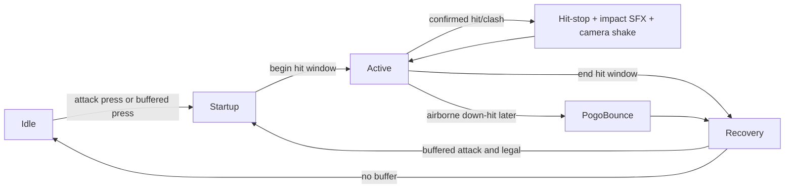

# Hollow Knight and Silksong attack-feel research for grounded attack movement shaping

## Executive summary

Your current controller architecture is already set up in the right way for a Hollow Knight-inspired attack pass: `HeroInputReader` collects intent, `HeroAttackAction` owns attack state and hit logic, `HeroAnimationController` closes attacks from animation end-events with a fail-safe timeout, and `HeroMotor` is the system that writes movement velocity. That separation is exactly what you want to preserve when you add attack movement shaping. In the current repo there is no dedicated attack input buffer, attack direction is chosen from vertical input against `attackDirectionThreshold`, dash is blocked during `attacking` and `attackRecovering`, wall slide is blocked while attacking, and slash startup SFX and on-hit feedback are currently split across different systems. fileciteturn27file0L3-L3 fileciteturn28file0L3-L3 fileciteturn10file0L3-L3 fileciteturn15file0L3-L3 fileciteturn12file0L3-L3 fileciteturn13file0L3-L3

Hollow Knight’s baseline melee feel is defined less by flashy cancels and more by compact, readable, movement-preserving swings, pogo as a first-class movement/combat verb, and very short, sharp impact feedback. Public documentation clearly supports pogo, parry, wall-cling, and relative attack-speed tuning, but I did **not** find an authoritative public frame table for base nail startup/active/recovery or a clearly documented built-in attack buffer/queue window. The strongest public numeric evidence I found was relative: Quick Slash increases Hollow Knight nail attack speed by 32%, while in Silksong Wanderer is about 34% faster than Hunter and Reaper about 23% slower than Hunter. citeturn8view1turn11view0turn29view0turn25view0turn26view1

Silksong’s feel is faster, more acrobatic, and more variable because Hornet’s base kit is explicitly more agile than the Knight’s, and Team Cherry has said the game’s enemy design was pushed upward to match that extra player capability. The released game’s public community analysis strongly reinforces that picture: Wanderer is the closest thing to Hollow Knight’s straightforward fast melee, while Hunter and Reaper deliberately shift the geometry, tempo, and aerial behaviour of down attacks and charged attacks. Silksong also adds a clearer “combat tech” layer than Hollow Knight through projectile deflection resetting attack cooldown, multi-hit parry follow-through, and crest-specific pogo/downslash behaviour. citeturn22news0turn10view1turn24view0turn25view0turn25view4turn39view3turn39view4

The best first implementation for your repo is therefore **not** attack buffering, hit-stop, or pogo first. It is a **small grounded attack movement-shaping pass** implemented **inside `HeroMotor`** using a configurable horizontal target-speed multiplier while `blackboard.attacking && blackboard.grounded`. Start with a **gentle** slowdown rather than a full root. Recommended first tunable: `groundAttackMoveMultiplier = 0.75f`, with a sensible tuning range of roughly **0.70–0.85** for HK-like feel. If, later, you want a more committed slash, test down to **0.66**; I would not start there. This keeps momentum readable, preserves your movement architecture, and matches the broad “mobile but committed” feel of both Hollow Knight and Silksong’s faster melee styles. fileciteturn9file0L3-L3 fileciteturn10file0L3-L3 citeturn25view0turn39view4turn8view1

## Current controller audit

The repo’s own architecture document describes a clean stack: `HeroController` coordinates, `HeroInputReader` produces typed input signals, `HeroActionController` runs `HeroJumpAction`, `HeroDashAction`, `HeroAttackAction`, and `HeroWallSlideAction`, `HeroMotor` handles `Rigidbody2D` velocity and gravity manipulation, and `HeroAnimationController` drives Animancer based on blackboard state. Update order is also clear: input/action intent in `Update`, sensors/actions/motor in `FixedUpdate`, visuals in `LateUpdate`. That is a strong base for combat feel work because it already implies a proper place to put motion shaping and a proper place to keep attack-state logic. fileciteturn27file0L3-L3

The combat spec shows that the attack pipeline is animation-led and directional: `HeroAttackAction.Tick` checks `AttackPressedThisFrame`, direction is derived from `MoveVector.y` against `HeroConfig.attackDirectionThreshold`, a directional `HeroAttackModule` is activated, hit windows are opened and closed by animation events, damage is checked every `FixedUpdate` during the active window, and animation end or a fail-safe timeout ends the swing. The same spec makes it explicit that hit receivers are deduped per swing with a `HashSet`. fileciteturn28file0L3-L3

`HeroConfig` currently exposes `attackCooldown`, `attackRecovery`, `attackDamage`, `maxHitsPerSwing`, `attackDirectionThreshold`, and `attackHitLayers`, but there is no attack movement-shaping field, no attack input buffer field, and no player-side attack hit-stop field yet. `HeroInputReader` has a jump buffer but not an attack buffer: it tracks `jumpBufferTimer`, `HasBufferedJump`, `ConsumeJumpBuffer`, and distinct jump release handling, whereas attack is only exposed as immediate `AttackPressedThisFrame` and `AttackHeld`. fileciteturn10file0L3-L3 fileciteturn15file0L3-L3

Action interaction is already conservative in a way that is broadly compatible with a Hollow Knight-like first pass. `HeroDashAction.CanStartDash` blocks dash if the hero is already `attacking` or `attackRecovering`, and `HeroWallSlideAction` refuses wall slide if `blackboard.attacking` is true. That means your first movement-shaping pass can leave action cancellation rules alone and focus just on ground velocity feel. fileciteturn12file0L3-L3 fileciteturn13file0L3-L3

There is also an important feedback split today. `HeroAttackModule.Activate` plays the slash whoosh immediately on module activation through a local `AudioSource`, while `EnemyHealthComponent.ReceiveHeroAttack` plays hurt SFX and triggers `GameManager.HitStop(config.hitStopDuration)` on the target side. `CameraShakeRequester` exists separately as a global requester, but it is not wired into the hero’s attack connect path in the code you exposed. That means the current repo already has the primitives for strong hit feel, but they are not yet centralised in a “first confirmed contact of this swing” path. fileciteturn18file0L3-L3 fileciteturn31file0L3-L3 fileciteturn35file0L3-L3 fileciteturn33file0L3-L3

## What Hollow Knight and Silksong actually feel like

Hollow Knight’s public mechanics documentation points to a combat loop built around short melee commitment, pogo, and precision mobility. The Knight can pogo by downward slashing enemies, spikes, and some objects, and that pogo is foundational enough that the wiki describes it as useful for both fighting and platforming and necessary for some sequence breaks and traversal. Parrying is possible against many white-trailed attacks and grants 0.25 seconds of invulnerability. Mantis Claw’s behaviour is similarly compact and readable: press into a wall in midair to cling and slide; jump to launch diagonally away; if both left and right are held, sliding falls back to normal falling speed. Quick Slash increasing nail attack speed by 32% is an unusually strong and revealing number: it tells you the base attack is already compact enough that a one-third increase materially changes the whole game’s combat tempo. citeturn9view2turn11view0turn29view0turn29view1turn8view1

Silksong keeps that spine but makes it more explicitly variable and more openly “mechanical”. Team Cherry has said Hornet is inherently faster and more skilful than the Knight, and that this pushed even base enemies to become more complicated and more intelligent. The public combat documentation supports that faster, more layered feel: projectile deflection resets Hornet’s attack cooldown immediately, parries still grant 0.25 seconds of invulnerability, and successful needle-bounces refresh Hornet’s mid-air abilities. In practice this means Silksong basic combat is not just “faster Hollow Knight”; it is more combinatorial, with more reasons for an attack to immediately affect what is allowed next. citeturn22news0turn29view3turn29view4turn29view5

The biggest practical difference is crest variance. On public community documentation and testing, Hunter is the baseline, Wanderer is the fast “closest to Hollow Knight” style, and Reaper is the larger/slower style. Wanderer is documented as roughly **+34%** attack speed versus Hunter, with a quick straight-down pogo that lacks sideways movement on a miss or delay before bounce on hit; Reaper is roughly **-23%** attack speed versus Hunter, gains broader arcs and knockback, and has a down-slash that briefly stalls Hornet before moving diagonally downward in the facing direction. Hunter, by contrast, keeps a diagonal downward strike and a more “Hornet-specific” geometry. Public DPS testing aligns with the feel descriptions: Wanderer’s consistent basic attack DPS is reported at **68.3** versus Hunter’s **50.9** baseline and Reaper’s **41.6**, while community commentary repeatedly describes Wanderer as the most consistent “real world” melee style and the most directly Hollow Knight-like pogo profile. citeturn25view0turn25view1turn25view2turn26view1turn25view5turn39view1turn39view3turn39view4

That leads to the key feel takeaway for your implementation: **Hollow Knight-like grounded attacks should not fully root the character**. They should reduce horizontal output enough to make the slash legible, but they should preserve carried momentum and allow continued advancement, especially for fast, Knight-like attack styles. Silksong’s Wanderer and Hollow Knight’s basic nail both point in that direction. Reaper demonstrates the opposite pole: more range and bigger output, but enough built-in stall and slower chaining that its pogo and grounded advance feel much more committal. citeturn25view0turn26view1turn39view4turn8view1

### Comparison of attack traits

| Trait | Hollow Knight | Silksong | Evidence |
|---|---|---|---|
| Core melee identity | Fast, compact nail swings with pogo as a core combat/platforming verb; Quick Slash adds +32% attack speed | Crest-dependent melee kits; Wanderer is the fast “Knight-like” style, Reaper the broader/slower style | citeturn8view1turn9view2turn25view0turn26view1 |
| Down attack and pogo | Downward nail slash bounces on enemies, spikes, and some objects | Needle-bounce refreshes mid-air abilities; down attack geometry changes by Crest | citeturn9view2turn29view5 |
| Closest “Knight-like” downslash | Base Knight pogo | Wanderer downslash is quick, directly beneath Hornet, with no extra delay before bounce | citeturn25view1turn29view5turn39view4 |
| Safer but slower aerial style | No direct equivalent in base Knight | Reaper downslash is broad and easier to land, but slower to chain and starts with a brief stall | citeturn26view1 |
| Parry | White-trailed attacks can be parried; grants 0.25 s invulnerability | Same 0.25 s invulnerability rule; multi-hit parries can auto-chain if you keep attacking | citeturn11view0turn29view4 |
| Projectile interaction | Public docs emphasise parry rather than cooldown reset | Deflecting certain projectiles resets attack cooldown immediately | citeturn29view3 |
| Wall combat interlock | Wall cling requires pressing into the wall; wall jump launches diagonally away | Cling Grip briefly sticks, then slowly slides; repeated jumps and sprint-climb deepen combat/platforming mobility | citeturn29view0turn9view1 |
| Public numeric timing evidence | Relative only in the sources I found | Relative only in the sources I found; strongest public numeric evidence is speed and DPS deltas | citeturn8view1turn25view0turn26view1turn39view3 |

### Attack state model



### Practical timing target

The sources I found do **not** publish a dependable public frame table for base Hollow Knight or base Silksong basic swings. The chart below is therefore an **implementation target**, not a canonical extraction. It is derived from the documented relative speed differences, the games’ publicly documented pogo/parry behaviour, and the observed “fast but not cancel-heavy” feel.

| Phase | HK-like grounded slash target | Silksong Wanderer-like target |
|---|---:|---:|
| Startup | 40–60 ms | 30–50 ms |
| Active | 60–90 ms | 50–80 ms |
| Recovery | 120–180 ms | 100–160 ms |
| Hit-stop on normal connect | 30–45 ms | 20–40 ms |
| Hit-stop on heavy connect or stagger | 50–70 ms | 40–60 ms |

The most important design lesson here is not the exact milliseconds; it is the ratio. The attack should *read* immediately, become dangerous quickly, and leave only a short, crisp post-swing tail. The moment you make grounded slashes feel like they “freeze you in place”, you move away from Hollow Knight and away from Silksong Wanderer. The moment you allow full run-speed freedom, you lose legibility. citeturn8view1turn25view0turn26view1turn39view4

## Direct implementation guidance for the repo

The current repo tells you very clearly where each piece belongs.

Movement shaping belongs in `HeroMotor`, not `HeroAttackAction`. The architecture doc explicitly positions `HeroMotor` as the system responsible for velocity and gravity manipulation, and the current implementation already concentrates hero `linearVelocity` writes there. Keep that invariant. `HeroAttackAction` should describe *state*, not directly push `Rigidbody2D` values. If later you add pogo or wall-attack impulses, those should still be exposed as motor methods such as `ApplyPogoBounce()` or `StartAttackLurch()`, not raw writes from the action class. fileciteturn27file0L3-L3 fileciteturn9file0L3-L3

The smallest grounded-attack movement-shaping change is to scale horizontal **target speed**, not raw velocity, while grounded and attacking. In practice that means adjusting `HeroMotor.ApplyHorizontalVelocity()` or the target-speed path it calls so that `targetX` is multiplied by a new config field when `blackboard.attacking && blackboard.grounded`. Do **not** directly multiply `body.linearVelocity.x` each frame; that usually feels mushy and over-damped. Scaling target speed preserves your existing acceleration/deceleration logic, which is already one of the cleaner parts of the controller. Files: `HeroConfig.cs` for the tunable, `HeroMotor.cs` for the actual behaviour. fileciteturn10file0L3-L3 fileciteturn9file0L3-L3

My recommended first tuning field is:

- `groundAttackMoveMultiplier = 0.75f`

Recommended testing range:

- **0.70–0.85** for Hollow Knight-like grounded attacks
- **0.66** only if you deliberately want a more planted slash

Why 0.75? Because your repo’s current top locomotion target is `runSpeed = 6.5f`; multiplying that by 0.75 yields `4.875f`, which is still meaningfully mobile rather than rooted. That is far more consistent with the “advance while slashing” feel of Hollow Knight and Silksong Wanderer than values around 0.4–0.5 would be. If, after testing, you want a sharper distinction between advancing and standing slashes, add a second field later for attack acceleration shaping — but not in task one. fileciteturn10file0L3-L3 citeturn25view0turn39view4

Attack input buffering is the next big feel win, but it should be a separate pass. Right now only jump is buffered in `HeroInputReader`; attack is not. A one-slot attack buffer of **0.08–0.12 seconds** would harmonise with your existing `jumpBufferTime = 0.1f` and would capture the “I pressed slightly early, but it still came out” responsiveness players expect from this genre. I would implement that in `HeroInputReader` and consume it in `HeroAttackAction` on the first legal frame, rather than layering queue logic into the animation system. File mapping: `HeroConfig.cs` add `attackBufferTime`; `HeroInputReader.cs` add `attackBufferTimer`, `HasBufferedAttack`, `ConsumeAttackBuffer`; `HeroAttackAction.cs` consume buffered attack when `CanStartAttack()` becomes true. fileciteturn10file0L3-L3 fileciteturn15file0L3-L3 fileciteturn28file0L3-L3

Direction selection should use a **small vertical-input memory**, even if the source games do not publicly expose a documented buffer. Both games clearly distinguish neutral, up, and down attacks, and Silksong further differentiates downslash geometry by Crest. In your codebase, the lowest-risk approach is a short “fresh vertical intent” window rather than a full combat queue. Recommended value: **60–100 ms**. File mapping: either store a timestamped last-non-zero-y in `HeroInputReader` or add a tiny helper in `HeroAttackAction`; continue to resolve the actual direction once per swing in `HeroAttackAction`, then lock it for that swing. This is especially important for future pogo and upslash feel. fileciteturn28file0L3-L3 citeturn24view0turn25view0turn26view1

Player attack impact feedback should be centralised. At the moment slash whoosh fires in `HeroAttackModule.Activate()`, while hit-stop is fired by `EnemyHealthComponent`. That is workable, but it is not ideal if you want consistent one-hit-per-swing impact feel, because multi-target swings or unusual receiver chains can duplicate or desynchronise global feedback. I recommend keeping **slash whoosh on activation** but moving **player-attack impact hit-stop and camera shake** to the hero attack side, triggered on **first confirmed damage or clash of the swing**. That means `HeroAttackAction` should own “this swing has connected” and request `GameManager.HitStop(...)` plus `CameraShakeRequester.ShakeHit()` once; enemy components should continue to own their local hurt/death SFX, flash and recoil. File mapping: `HeroAttackAction.cs`, `GameManager.cs`, `CameraShakeRequester.cs`, optionally `HeroConfig.cs` for `attackHitStopDuration` and `attackClashHitStopDuration`, with `EnemyHealthComponent.cs` simplified so it no longer owns the generic player-hit-stop response. fileciteturn18file0L3-L3 fileciteturn31file0L3-L3 fileciteturn35file0L3-L3 fileciteturn33file0L3-L3

Recommended first-pass feedback numbers:

- normal attack connect: **0.03–0.05 s**
- clash/parry/heavier connect: **0.05–0.07 s**
- rapid multi-hit or future pogo connect: **0.02–0.03 s**

That matches the broad feel of Hollow Knight’s crisp impact and Silksong’s even faster “tech” layer without getting gummy. Hollow Knight and Silksong both document 0.25-second invulnerability on parry, which is much larger than the hit-stop itself and is a useful reminder not to confuse those two layers. citeturn11view0turn29view4

### File mapping summary

| Concern | Recommended file | Suggested addition |
|---|---|---|
| Grounded slash movement shaping | `HeroMotor.cs` | Multiply horizontal **target speed** while `attacking && grounded` |
| Tuning field | `HeroConfig.cs` | `groundAttackMoveMultiplier` |
| Attack input buffering | `HeroInputReader.cs` + `HeroAttackAction.cs` | one-slot attack buffer + consume on first legal frame |
| Buffer tuning | `HeroConfig.cs` | `attackBufferTime` |
| Vertical direction memory | `HeroInputReader.cs` or `HeroAttackAction.cs` | short-lived last vertical attack intent |
| Hit-stop and shake on first connect | `HeroAttackAction.cs` | one-per-swing impact event |
| Global feedback hook | `GameManager.cs` + `CameraShakeRequester.cs` | reused, but triggered by hero attack connect |
| Slash whoosh | `HeroAttackModule.cs` | keep startup SFX here unless you later centralise audio |
| Animation-led end and fallback | `HeroAnimationController.cs` + `HeroActionController.cs` | preserve current completion + later improve fallback window authoring |

## Proposed first task

### Exact behaviour

Implement **grounded attack movement shaping** only.

While the hero is **grounded** and **attacking**, scale horizontal target speed by a new config multiplier. Preserve the existing acceleration/deceleration behaviour; do not directly overwrite X velocity every frame. Do not change aerial attack movement. Do not change dash cancellation, jump cancellation, wall-slide rules, hit windows, attack buffering, or pogo in this task. Keep all velocity writes inside `HeroMotor`. fileciteturn9file0L3-L3 fileciteturn12file0L3-L3 fileciteturn13file0L3-L3

### Files to change

- `Assets/_Project/Scripts/Hero/Core/HeroConfig.cs`
- `Assets/_Project/Scripts/Hero/Movement/HeroMotor.cs`

No other file should be required for the first pass.

### New `HeroConfig` field

```csharp
[Header("Attack Feel")]
[Range(0f, 1f)] public float groundAttackMoveMultiplier = 0.75f;
```

### Recommended implementation detail

In `HeroMotor.ApplyHorizontalVelocity()`:

- compute `targetX` from input and target locomotion speed as normal
- if `blackboard.attacking && blackboard.grounded && !blackboard.dashing`, multiply `targetX` by `config.groundAttackMoveMultiplier`
- continue to use existing acceleration/deceleration to move toward that target

This gives the right sort of “still moving, but committed” feel. It also avoids the common mistake of hard-capping or repeatedly re-scaling current velocity, which tends to feel sticky and synthetic.

### Acceptance criteria

- A standing ground slash behaves visually exactly as before.
- A running ground slash still carries the hero forward, but at a clearly reduced pace.
- Repeated ground slashes while holding forward advance the hero, but do not feel like unrestricted full-speed running.
- Aerial slashes feel unchanged.
- Dash, wall slide, and jump behaviour remain unchanged.
- No new hero `Rigidbody2D.linearVelocity` writes appear outside `HeroMotor`. fileciteturn9file0L3-L3

### Manual playtest checklist

- From idle, slash on the ground: no strange foot sliding, no sudden backward drift.
- From a full run, press attack once: momentum is preserved, but target pace is clearly lower.
- Hold forward and mash attack on flat ground: hero advances consistently without looking rooted or uncontrollably slippery.
- Walk slowly and slash: attack does not feel over-damped or frozen.
- Slash at a ledge and walk off mid-swing: airborne movement remains unchanged.
- Jump, attack in air, land during the attack: only the grounded portion feels shaped.
- Attack, then dash as soon as legally possible: dash timing remains exactly as before.
- Attack near a wall: wall slide still cannot begin during attack.
- Verify the project still compiles and that movement writes remain confined to `HeroMotor`. fileciteturn12file0L3-L3 fileciteturn13file0L3-L3

## Prioritised follow-up work

The next pass after grounded movement shaping should be **attack input buffering and one-slot queuing**. This is the highest-feel-per-line-of-code improvement because your repo already buffers jump but not attack, and action games of this style benefit disproportionately from slight early input forgiveness. Keep it modest — one buffered attack request, 80–120 ms, consumed on the first legal frame. That will make the controller feel more deliberate without turning it into a combo game. fileciteturn15file0L3-L3

After that, prioritise **first-connect impact feedback centralisation**. Your current feedback path is split between attack startup (`HeroAttackModule`) and target-side hurt logic (`EnemyHealthComponent`). Centralising hit-stop and camera shake on the hero side, once per swing, will make attacks feel cleaner and will avoid redundant feedback when multiple things are hit or when various receivers are involved. fileciteturn18file0L3-L3 fileciteturn31file0L3-L3

Then implement **hit-window fallback authoring**. The repo already has animation-event-driven windows and an animation fail-safe timeout, which is good, but the next robustness step is to give each attack a guaranteed fallback active-window definition in case authored events are missing or wrong. That should live with attack data or config, not as hardcoded per-clip magic. fileciteturn28file0L3-L3 fileciteturn20file0L3-L3

After that, move onto **pogo/downslash**. Both games treat pogo as identity-level combat movement, not a special trick. Hollow Knight uses downward nail bounce on enemies, spikes and objects; Silksong refreshes mid-air abilities on successful needle-bounce and gives that move different geometry by crest. For your codebase, pogo should be implemented as a confirmed down-hit reaction in `HeroAttackAction` that calls a dedicated motor method rather than directly touching velocity from the action class. Add it only after basic grounded slash feel and buffering are solid. citeturn9view2turn29view5turn25view0turn26view1

Finally, tackle **direction memory and special combat-tech interactions** such as cooldown reset on projectile deflect, upslash consistency, and later dash/jump/wall-jump interaction audits. Silksong shows that immediate cooldown resets on specific defensive interactions can feel excellent, but that is a second-order polish feature, not where you should start. citeturn29view3

## Open questions and limitations

I did **not** find a dependable public authoritative frame-by-frame table for base Hollow Knight nail startup/active/recovery or for Silksong’s basic Needle timings. The clearest public numeric evidence I found was **relative** attack-speed and DPS data — Quick Slash’s +32% in Hollow Knight, Wanderer’s roughly +34% versus Hunter in Silksong, Reaper’s roughly -23% versus Hunter, and post-release Silksong crest DPS testing. That is enough to guide implementation targets and comparative feel, but not enough to claim a canonical exact frame table. citeturn8view1turn25view0turn26view1turn39view3

I also did not find a public official statement of an explicit built-in attack buffer or queue window for Hollow Knight or Silksong basic swings. The buffering recommendation in this report is therefore an implementation recommendation for your controller, not a claim that Team Cherry uses that exact buffer. The same caution applies to the timing chart above: it is a grounded design target derived from the strongest public evidence I found, not a reverse-engineered truth table.