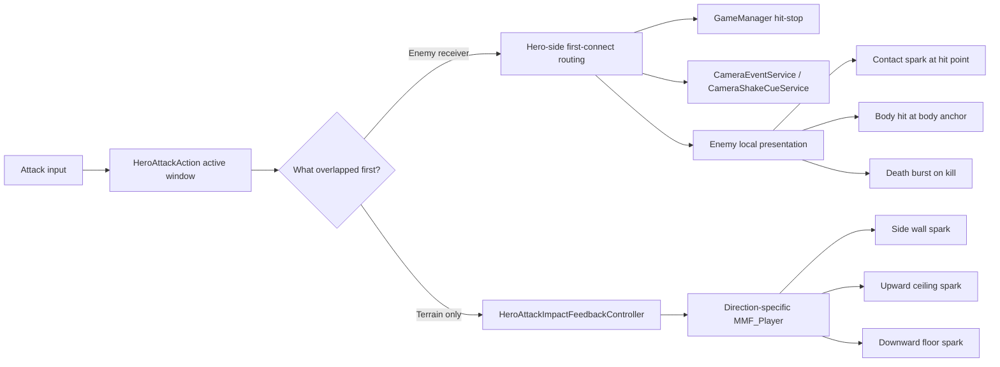

# More Mountains Feel Integration for Metroidvania Combat Impact

## Executive summary

Your repo is already in a good place for a **combat impact pass** because the critical responsibilities are separated cleanly. The hero attack pipeline already computes contact points, tracks one-hit-per-swing via `HashSet`s, and distinguishes normal hits, clashes, and downslash responders. The hero side already has attack buffering and a dedicated `ApplyDownslashBounce()` hook in `HeroMotor`. Time-scale control is centralised in `GameManager`, audio is routed through `AudioManager`, and camera shake is already abstracted behind `CameraEventService` and `CameraShakeCueService`, which can use optional `MMF_Player` presets or fall back to More Mountains shake events. That means you do **not** need to bolt Feel onto every gameplay object to get strong juice; you can keep code authoritative and let Feel stay presentation-only. fileciteturn24file0L3-L3 fileciteturn25file0L3-L3 fileciteturn61file0L3-L3 fileciteturn58file0L3-L3 fileciteturn31file0L3-L3 fileciteturn32file0L3-L3 fileciteturn33file0L3-L3 fileciteturn34file0L3-L3

The strongest recommendation is a **hybrid architecture**. Keep **camera shake and hit-stop central**, keep **terrain and wall sparks hero-side**, and keep **enemy-local body/death reactions on enemy prefabs**. In practice, that means you do **not** need four unique Feel players on every enemy. You need about **three conceptual enemy cues**—contact spark, body reaction, death burst—with an **optional pogo override** only for enemies that genuinely benefit from it. Terrain impacts should be handled by a new hero-side presentation component, not by putting MM Feel on walls and floors. This lines up with Feel’s own recommended usage pattern—empty child objects with `MMF_Player` components triggered from explicit code hooks—and with the repo’s own rule that camera, timescale, and audio routing stay centralised. fileciteturn56file0L3-L3 fileciteturn55file0L3-L3 citeturn2view0turn3view0turn3view1turn4view0

For reference tone, **Hollow Knight** is best understood as “compact, readable melee with very short impact punctuation,” while **Silksong** pushes toward “faster, more acrobatic, more combinatorial combat.” Team Cherry’s own public language supports that reading: Hollow Knight is framed around “skills and reflexes,” while Silksong promises “lethal acrobatic action” and explicitly says Hornet is faster and more skilful than the Knight, which forced enemies to become more complex as well. Team Cherry has not published a canonical public hit-stop frame table, so any exact timings should be treated as **implementation targets**, not reverse-engineered fact. The best available impact-feel research also points to **hit stop, sound coherence, and camera control** as the highest-leverage impact variables. citeturn10view1turn10view0turn21view0turn16academia2turn18academia0

Because the connector-visible GitHub branch still shows an empty `ReceiveHeroDownslash()` on `EnemyHealthComponent`, the safest **next Codex task** is a **small, isolated hero-side implementation**: add terrain/wall impact feedback routing for side/up/down slashes, using a new presentation-only hero feedback component plus one-per-swing suppression. That is high value, bounded in scope, and does not depend on your local unpushed enemy-feedback changes being present on the remote branch. fileciteturn49file0L3-L3

## Repo audit and current integration points

The current hero attack flow is already set up to support impact routing cleanly. `HeroAttackAction` activates a directional `HeroAttackModule`, checks damage and clash overlaps during the active window, computes hit positions from `ClosestPoint(referencePoint)`, builds a `HeroAttackHit` carrying `Source`, `Direction`, `Damage`, `Point`, and `ForceDirection`, then notifies `IHeroAttackReceiver` and, for down-attacks, `IHeroDownslashResponder`. It also prevents repeat hits on the same receiver in one swing and only applies the motor bounce once per downslash attack. fileciteturn24file0L3-L3 fileciteturn25file0L3-L3 fileciteturn28file0L3-L3

`HeroAttackModule` already gives you most of the data you need for terrain impacts. Each module has authored damage and clash colliders, optional per-module layer masks, a reference point from the damage collider’s bounds centre, and a startup slash SFX played through `AudioManager` on activation. That means terrain impact detection can piggyback on the same attack-window timing and collider geometry rather than inventing a second weapon system. fileciteturn26file0L3-L3 fileciteturn27file0L3-L3

On the hero movement side, the repo already contains two important combat-feel hooks. `HeroInputReader` has an attack buffer timer and exposes `HasBufferedAttack` and `ConsumeAttackBuffer()`, while `HeroMotor` already has `ApplyDownslashBounce()` and also shapes grounded slash movement with `groundAttackMoveMultiplier` during `ApplyHorizontalVelocity()`. So your current combat pass is not starting from zero; it is adding richer feedback on top of an existing movement-and-timing spine. fileciteturn61file0L3-L3 fileciteturn59file0L3-L3 fileciteturn58file0L3-L3

Enemy-side hit handling is still intentionally simple on the connector-visible branch. `EnemyHealthComponent` flashes the sprite, plays `hurtSfx`, requests `GameManager.HitStop(config.hitStopDuration)`, and then either recoils or dies; `ReceiveHeroDownslash()` is currently empty in the remote repo. `EnemyConfig` supplies hurt/death audio and the hit-stop duration. `EnemyRecoil` already owns freeze-on-hit versus knockback behaviour, stun timing, and blackboard hurt/recoiling flags. That means enemy MM Feel should stay **presentation-only** and should not re-implement hit-stop or knockback. fileciteturn49file0L3-L3 fileciteturn23file0L3-L3 fileciteturn22file0L3-L3

The repo also already has a clean central place for camera and time feedback. `GameManager` owns pause and hit-stop via `Time.timeScale`; the architecture doc explicitly says nothing else in the project should manage timescale. `CameraEventService` exposes shake and freeze requests, while `CameraShakeCueService` can either play optional `MMF_Player` presets or fall back to More Mountains camera shake events. The camera feature spec strongly reinforces that camera shake should be routed through this service and that `MMF_Player` assignments there are optional. fileciteturn31file0L3-L3 fileciteturn40file0L3-L3 fileciteturn33file0L3-L3 fileciteturn34file0L3-L3 fileciteturn56file0L3-L3

Audio-wise, the current runtime `AudioManager` exposes `PlaySFX` and `PlayMusic`, and the repo’s audio spec explicitly says gameplay prefabs should not call `AudioSource.Play()` or `PlayOneShot()` directly. That is an important architectural rule for a Feel integration: use Feel for visual-local presentation and, where appropriate, sound feedbacks, but do not let enemy prefabs become bespoke audio routers that bypass the project’s own manager. fileciteturn32file0L3-L3 fileciteturn55file0L3-L3

## Recommended feedback architecture

The right architecture for this project is **not** “put four MMF players on everything.” The right architecture is: **hero-side global impact routing for terrain and universal combat punctuation, enemy-side local presentation for body/death feel, and central services for camera/time/audio**. That split matches the repo’s current authority boundaries and avoids building a second gameplay system inside Feel. fileciteturn40file0L3-L3 fileciteturn56file0L3-L3 citeturn3view0turn3view1turn4view0

### Option comparison

| Approach | What it means in your project | Strengths | Weaknesses | Recommendation |
|---|---|---|---|---|
| Per-enemy unique MMF setup | Every enemy prefab owns bespoke contact/body/death players | Maximum uniqueness; easy per-enemy tuning | High authoring cost; duplication; easy to drift from style guide | Use only for minibosses or signature enemy families |
| Shared enemy feedback prefab or prefab variant | Most enemies share one nested `Feedbacks` setup, with a few family variants | Scales well; consistent look; low maintenance | Less bespoke unless you author variants | **Best default for enemies** |
| Centralised feedback runner | Hero/global service plays shared sparks, terrain hits, camera events, and maybe pooled VFX | Best for terrain, walls, pooled hit sparks, one-per-swing rules | Cannot express enemy-specific body deformation alone | **Best for terrain and universal contact punctuation** |
| Hybrid | Central hero/global routing + local enemy presentation | Preserves architecture, scales, still allows enemy personality | Slightly more coordination in code | **Recommended overall** |

This recommendation is also consistent with Feel’s own documentation. Their starter workflow is “create empty child objects, add `MMF_Player`, assign them to public fields, and trigger them from code,” not “attach feedback logic to every arbitrary collider in the level.” Their docs also encourage using an intensity language for shakes and keeping meaning consistent across events, which matches your existing `CameraShakeCueService` structure well. citeturn2view0turn3view0turn3view1turn4view0

For enemy events specifically, I recommend thinking in **conceptual cues** rather than “mandatory unique players.” The moments are: **contact spark at hit point**, **body reaction at body position**, **death burst at body position**, and **optional pogo override at hit point**. In other words, you may want four *hooks*, but you do **not** need four bespoke authored setups on every enemy. The default should be three real enemy cues—contact, body, death—with pogo simply falling back to the normal contact spark unless an enemy family truly needs a special downward accent. That preserves Hollow Knight-like readability without turning authoring into a combinatorial prefab problem. fileciteturn49file0L3-L3 fileciteturn58file0L3-L3 citeturn10view1turn10view0

The repo’s current central camera and hit-stop setup also argues against putting heavy camera logic into every enemy `MMF_Player`. A body-hit player may include **local squash, sprite flash, small particle burst**, and perhaps a tiny local sound if you deliberately choose Feel’s sound feedback system, but **camera shake and hit-stop should remain code-routed** through `CameraEventService` / `CameraShakeCueService` and `GameManager`. That keeps combat punctuation consistent and prevents enemy prefabs from competing over global effects. fileciteturn31file0L3-L3 fileciteturn33file0L3-L3 fileciteturn34file0L3-L3 fileciteturn56file0L3-L3

### Placement, positioning, null-safety, asmdefs, and performance

Feel’s docs and your current camera service both support a simple placement pattern: put `MMF_Player` components on **empty child objects** that exist only for presentation, and call them explicitly from code. In your project, that means `EnemyFeedbackController` or an equivalent presentation component should live on a `Feedbacks` child, not be mixed into your combat or physics root. For one-shot combat cues, disable auto-play on start/enable and drive them from code. citeturn2view0turn3view0turn3view1

Use `PlayFeedbacks(Vector3)` when the cue is fundamentally **about a contact point**—surface sparks, slash-on-wall sparks, pogo spark accents, ground scrape bursts. The installed Feel code in your repo exposes the overload that accepts a world position and an optional intensity, which is the correct tool for point impacts. Use plain `PlayFeedbacks()` when the cue is **about the host transform**—body squash, local sprite flash, death burst anchored to the enemy, or a self-owned shake proxy. In practice, separate “point cue” and “body cue” players are cleaner than trying to move one player’s transform around every frame. fileciteturn43file0L3-L3 citeturn3view1turn3view3

Null-safety is important because your game is already using optional service-style components. Treat every MM Feel field as optional and let unassigned fields no-op. For overlap-heavy combat, also use one-per-swing suppression booleans on the code side rather than relying on `MMF_Player` cooldowns to solve gameplay duplication. Feel’s own settings let you prevent replay while already playing, but that is a presentation guard, not a substitute for combat-side dedupe. citeturn3view1turn3view3

Asmdef-wise, the highest-confidence finding is that the current main branch already compiles project code against More Mountains because `CameraShakeCueService` directly references `MoreMountains.Feedbacks` and optional `MMF_Player` fields. I did **not** verify the exact Feel asmdef names or `autoReferenced` settings from the connector scan, so if you later split your gameplay scripts into custom asmdefs, add an **explicit reference** to the Feel runtime assembly instead of assuming assembly auto-reference will continue to save you. That point is especially important if Codex later introduces new asmdefs. fileciteturn34file0L3-L3

Performance-wise, authoring cost is a bigger risk than CPU cost for your current scope. Dozens of lightweight `MMF_Player` components are usually fine; dozens of uniquely-authored enemy feedback hierarchies are where maintenance pain starts. Prefer **shared prefab variants** for common enemy families, keep terrain impacts hero-side, and pool or reuse particle-heavy effects if you notice spikes. Also keep Offscreen/Distance filtering in mind later for camera requests; your camera spec already lists offscreen shake filtering as a future TODO. fileciteturn56file0L3-L3 citeturn4view0turn18academia0



## Hollow Knight and Silksong patterns

Team Cherry’s public descriptions establish the broad combat tone clearly. Hollow Knight is framed around using “skills and reflexes to survive,” while Silksong promises “lethal acrobatic action,” “devastating attacks,” and a much larger enemy roster. Separately, Team Cherry has said Hornet is “inherently faster and more skillful than the Knight,” and that this required even base enemies in Silksong to become “more complicated, more intelligent.” That is the strongest public evidence for why Silksong feels faster and more layered than Hollow Knight. citeturn10view1turn10view0turn21view0

What Team Cherry has **not** publicly published, at least in the sources I could verify, is a canonical timing document for impact freeze, spark frame counts, or exact attack startup/active/recovery breakdowns. Your own repo’s research documents explicitly note the same limitation. So the most responsible reading is: Hollow Knight and Silksong give us a **clear style target**, not a public exact frame table. fileciteturn46file0L3-L3

That style target is consistent and useful. Hollow Knight’s hits tend to read as **small, immediate, crisp punctuations**: a successful strike gets a tiny impact burst at the contact point, the target reacts or flashes, and heavier moments like kills, staggers, or major boss hits get more visible emphasis. Silksong keeps the same readability but pushes the follow-through faster and the enemy responses more aggressively, because Hornet herself is more mobile and attacks are more acrobatic. That reading is an inference from the official descriptions above plus the project’s own internal Hollow Knight/Silksong research, not from a published Team Cherry spec. fileciteturn46file0L3-L3 citeturn10view1turn10view0turn21view0

For implementation, the most useful lesson is **priority**, not exact frames. The impact stack should usually be: **swing whoosh on startup**, then on confirmed connect **contact spark + enemy flash/body reaction + impact sound**, then **very short hit-stop**, then **light camera shake** for normal hits and **heavier camera punctuation** for kills, staggers, and other high-salience events. This lines up with the best available impact-feel literature, which finds hit stop, sound coherence, and camera control especially important, and with Feel’s own advice to define a clear “language” of shake intensity and meaning. citeturn16academia2turn18academia0turn4view0

The practical recommendation for your repo is therefore: keep normal hit-stop short, reserve stronger shake and larger burst payoffs for meaningful events, and let pogo hits sound and feel slightly more “snappy” than grounded side slashes without turning them into a completely different VFX language. A sensible first range is around **0.02–0.04 seconds** for normal connect punctuation and **0.05–0.07 seconds** for kill/heavy/stagger punctuation, but those numbers are design targets informed by genre feel and research, not official Hollow Knight constants. citeturn16academia2turn4view0

## Terrain impacts and source-aware routing

Terrain and wall sparks should be handled **hero-side**, not level-side. Your current attack system already knows when the attack window is active, already has the correct attack collider shape per direction, and already computes a reference point. The cleanest design is: extend `HeroAttackAction` to detect terrain overlaps during the active window, then route presentation to a new `HeroAttackImpactFeedbackController` that owns direction-specific `MMF_Player` fields. That avoids putting any Feel components on walls, floors, or tilemaps. fileciteturn24file0L3-L3 fileciteturn26file0L3-L3

I recommend a **new hero presentation component** instead of stuffing more direct MM Feel calls into `HeroAttackAction`. Let `HeroAttackAction` stay authoritative for *when* a terrain impact was confirmed, and let `HeroAttackImpactFeedbackController` own *how* it is presented. This is the same separation you have elsewhere in the project: code decides state and timing, presentation components decide visuals. Feel’s own docs support this explicit-code-to-player pattern. citeturn2view0turn3view0

Detection should happen in `HeroAttackAction`, because that is where the active window, direction, and per-swing dedupe already live. The simplest robust implementation is: during `EvaluateDamageCollider()`, or immediately after it, do a second overlap pass against `attackTerrainLayers` using the current module’s damage collider. If `attackTerrainLayers` is zero, fall back to `HeroConfig.terrainLayers`. Pick the nearest terrain collider using distance from `referencePoint`, compute the contact via `ClosestPoint(referencePoint)`, and if that point is ambiguous because the collider is already deeply overlapping, fall back to a short raycast in `GetForceDirection()`. fileciteturn24file0L3-L3 fileciteturn26file0L3-L3 fileciteturn36file0L3-L3

Duplicate suppression matters more than the raw overlap test. The safest first rule is **one terrain impact max per swing**, and only if **no enemy receiver or clash has already consumed the main impact punctuation for that swing**. This matches what players usually read in Hollow Knight-like combat: wall sparks are mostly for *whiffing into geometry*, not for layering on top of a valid enemy hit behind that wall. For down-attacks, also suppress terrain spark if the swing already produced a valid pogo/downslash bounce on a target. fileciteturn24file0L3-L3 fileciteturn58file0L3-L3

The hero-side feedback controller should expose four optional fields: **side**, **up**, **down**, and **fallback**. Side/up/down are the authored ideal cases; fallback is there so missing assignments do not break testing. For a first pass, side and down matter the most. Upward ceiling sparks are still worth supporting because your repo already resolves upward attack direction explicitly. fileciteturn24file0L3-L3 fileciteturn36file0L3-L3

On source-awareness: under the current architecture, enemy-vs-enemy interactions will **not** accidentally trigger hero-specific attack feedback unless you later overload the hero-only API for generic damage. `HeroAttackHit` explicitly carries a `Source` object, and the contract is still named `ReceiveHeroAttack(HeroAttackHit)`. Enemy body-touch damage to the hero goes through a separate path: `EnemyContactDamage` sends damage to `HeroBox`, which buffers it and forwards it to `HeroHealthComponent`. So today’s code already separates hero-origin attack routes from generic damage routes. The best way to keep it safe is: **do not reuse `ReceiveHeroAttack` for non-hero damage**. If you later add enemy-vs-enemy combat, introduce a neutral `DamageContext` / `HitContext` API and keep hero-specific impact presentation gated behind `SourceKind == HeroWeapon` or equivalent. fileciteturn28file0L3-L3 fileciteturn50file0L3-L3 fileciteturn38file0L3-L3 fileciteturn39file0L3-L3 fileciteturn30file0L3-L3

## Unity setup and next Codex prompt

For enemies, the clean setup is:

| GameObject | Component | Use position from |
|---|---|---|
| `EnemyRoot/Feedbacks` | `EnemyFeedbackController` | n/a |
| `EnemyRoot/Feedbacks/ContactSpark` | `MMF_Player` | `hit.Point` |
| `EnemyRoot/Feedbacks/BodyHit` | `MMF_Player` | enemy body anchor / root |
| `EnemyRoot/Feedbacks/DeathBurst` | `MMF_Player` | enemy body anchor / root |
| `EnemyRoot/Feedbacks/PogoOverride` | optional `MMF_Player` | `hit.Point` |

For the hero, add one presentation-only child:

| GameObject | Component | Use position from |
|---|---|---|
| `Hero/AttackImpactFeedbacks` | `HeroAttackImpactFeedbackController` | n/a |
| `Hero/AttackImpactFeedbacks/TerrainSide` | `MMF_Player` | terrain contact point |
| `Hero/AttackImpactFeedbacks/TerrainUp` | optional `MMF_Player` | terrain contact point |
| `Hero/AttackImpactFeedbacks/TerrainDown` | optional `MMF_Player` | terrain contact point |
| `Hero/AttackImpactFeedbacks/Fallback` | optional `MMF_Player` | terrain contact point |

Author the **minimum first-pass asset set** before you try to get fancy: one small white contact spark, one subtle body flash or scale punch, one death burst, and one compact wall/floor impact spark. Let the existing slash whoosh remain the swing-start layer; add the impact tick/crack/pop as the connect layer. If you later want richer Feel sequences, use pauses or per-feedback delays inside the same `MMF_Player` rather than spreading one cue across multiple code paths. citeturn3view3turn3view4turn4view0

The most useful **next Codex prompt** is this small implementation task:

```text
Implement hero-side terrain impact feedback routing for slash hits against walls/floors/ceilings, preserving the current architecture and using More Mountains Feel as presentation only.

Context:
- Repo: Perkiiii/Metroidvania-Controller
- Read these files before changing anything:
  - Assets/_Project/Scripts/Hero/Actions/HeroAttackAction.cs
  - Assets/_Project/Scripts/Hero/Combat/HeroAttackModule.cs
  - Assets/_Project/Scripts/Hero/Combat/HeroAttackHit.cs
  - Assets/_Project/Scripts/Hero/Core/HeroConfig.cs
  - Assets/_Project/Scripts/Hero/HeroController.cs
  - Assets/_Project/Scripts/World/GameManager.cs
  - Assets/_Project/Scripts/Audio/AudioManager.cs
  - Assets/_Project/Scripts/Camera/CameraEventService.cs
  - Assets/_Project/Scripts/Camera/CameraShakeCueService.cs
  - Docs/Architecture.md
  - Docs/FeatureSpecs/Audio.md
  - Docs/FeatureSpecs/Camera.md

Goal:
Add a presentation-only hero component that plays MMF_Player feedback when a side/up/down slash hits terrain, without requiring MM Feel on walls or floors.

Requirements:
1) Create a new MonoBehaviour:
   Assets/_Project/Scripts/Hero/Feedback/HeroAttackImpactFeedbackController.cs

2) HeroAttackImpactFeedbackController must be presentation-only and null-safe.
   Fields:
   - MMF_Player sideTerrainImpact
   - MMF_Player upTerrainImpact
   - MMF_Player downTerrainImpact
   - MMF_Player fallbackTerrainImpact
   Public method:
   - void PlayTerrainImpact(HeroAttackDirection direction, Vector3 worldPosition)

3) Modify HeroAttackAction so that during the active damage window it can detect terrain impact from the current attack module’s damage collider.
   - Add one terrain overlap pass using a terrain layer mask.
   - Add a new HeroConfig field:
     public LayerMask attackTerrainLayers;
     If attackTerrainLayers == 0, fall back to config.terrainLayers.
   - Compute contact point using hitCollider.ClosestPoint(referencePoint).
   - If ClosestPoint is unusable because the reference is already inside the collider, use a short raycast fallback from the reference point in GetForceDirection() and fall back to bounds centre only if needed.

4) Duplicate suppression rules:
   - Only one terrain impact feedback per attack swing.
   - Do not play terrain impact if this swing already confirmed an IHeroAttackReceiver hit.
   - Do not play terrain impact if this swing already confirmed an IHeroAttackClashReceiver hit.
   - For down attacks, do not play terrain impact if a valid downslash responder/pogo bounce was triggered this swing.
   - If multiple terrain colliders overlap, choose the nearest valid contact point to the module reference point.

5) Wiring:
   - Auto-find HeroAttackImpactFeedbackController from the hero hierarchy if practical, or inject it through existing controller initialization in the smallest clean way.
   - Do not add MM Feel to terrain objects.
   - Do not modify GameManager hit-stop behavior in this task.
   - Do not add direct Time.timeScale writes.
   - Do not add direct AudioSource.Play / PlayOneShot calls on gameplay prefabs.
   - Do not move camera transforms directly; camera requests must remain routed through existing camera services if needed later.
   - If Enemy/Feedback/EnemyFeedbackController.cs exists in the working tree, leave enemy feedback behavior untouched in this task.

Likely files changed:
- Assets/_Project/Scripts/Hero/Feedback/HeroAttackImpactFeedbackController.cs (new)
- Assets/_Project/Scripts/Hero/Actions/HeroAttackAction.cs
- Assets/_Project/Scripts/Hero/Core/HeroConfig.cs
- Possibly one hero initialization file only if needed for clean wiring

Acceptance criteria:
- A side slash into a wall with no enemy hit this swing plays one terrain impact feedback at the wall contact point.
- An up slash into a ceiling with no enemy hit this swing plays one terrain impact feedback at the ceiling contact point.
- A down slash into the floor with no pogo/enemy/clash this swing plays one terrain impact feedback at the floor contact point.
- A down slash that successfully pogo-bounces on an enemy does not also play the terrain impact feedback that swing.
- No terrain object requires MMF_Player or any new MonoBehaviour.
- No duplicate terrain sparks occur from composite/tilemap overlap during one swing.
- Existing enemy hurt/death, hero pogo bounce, slash SFX, hit-stop, and camera systems continue to behave as before.
- Compile with no new errors.
```

For Unity authoring and playtesting, keep the checklist small at first:

- Add the new hero feedback child and assign at least `sideTerrainImpact` and `fallbackTerrainImpact`.
- Leave Auto Play on Start and Auto Play on Enable off on all combat MMF players.
- Test side slash into wall, up slash into ceiling, down slash into floor, downslash pogo on enemy, and slice an enemy while standing against a wall.
- Confirm one spark max per swing and no camera/time/audio regressions.
- Confirm enemies with no local feedback setup still behave identically. citeturn3view1turn2view0

## Open questions and limitations

The GitHub connector reflects the remote repo state, not necessarily your local working tree. That matters here because the remote `EnemyHealthComponent` still shows an empty `ReceiveHeroDownslash()`, so your local Feel integration work may already be ahead of what I could inspect through GitHub. fileciteturn49file0L3-L3

I did not verify the exact Feel asmdef names or whether your installed package version is relying on `autoReferenced` assemblies internally. I only verified that the current project already compiles against More Mountains from project code through `CameraShakeCueService`, and that the Feel runtime in the repo exposes `MMF_Player.PlayFeedbacks(Vector3)`. If you later introduce custom asmdefs, add explicit references rather than assuming package defaults. fileciteturn34file0L3-L3 fileciteturn43file0L3-L3

Team Cherry’s public material is strong on **combat identity** and **relative speed**, but not on exact impact-freeze numbers or frame-by-frame hit timing. Where I gave timing ranges, they are implementation targets informed by action-game feel research and by Hollow Knight/Silksong’s observable style, not official Team Cherry frame data. fileciteturn46file0L3-L3 citeturn16academia2turn18academia0turn10view1turn10view0turn21view0