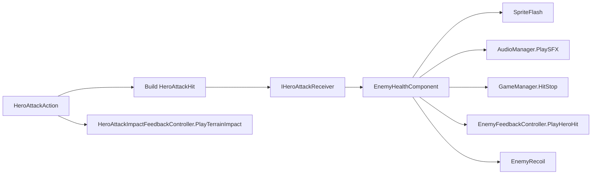
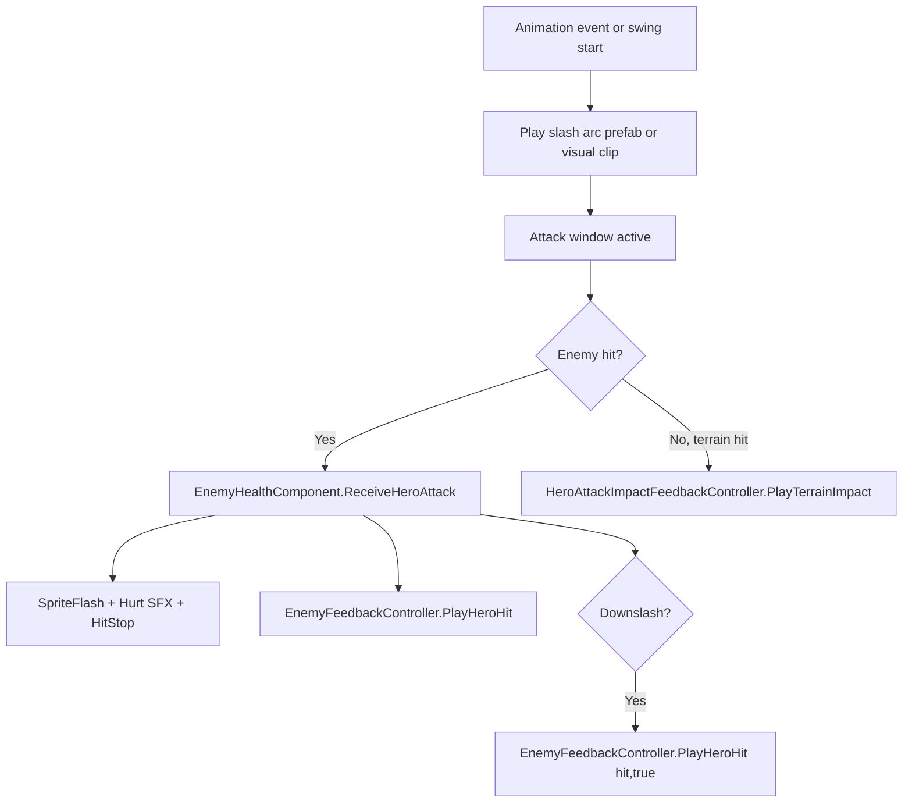

# Enemy Hit VFX Responsibility and Hollow Knight Style Slash VFX in Unity

> Stage 1 status note: the current implementation now routes generic player-attack hit-stop and camera shake from `HeroAttackAction` once per swing. `EnemyHealthComponent` remains responsible for enemy-local damage, flash, hurt/death audio, enemy feedback, recoil, and death.

## Executive summary

In the connector-visible `Perkiiii/Metroidvania-Controller` repo, the enemy hit VFX path is **not centred on a class named `EnemyHitEffects`**. Instead, the current combat pipeline routes confirmed weapon contact through `HeroAttackAction`, into `EnemyHealthComponent`, and then into `EnemyFeedbackController` for point-hit sparks, pogo sparks, body-hit feedback, and death feedback. Terrain whiff impacts are handled separately by `HeroAttackImpactFeedbackController`, while transient white flash is handled by `SpriteFlash`, audio by `AudioManager`, and hit-stop by `GameManager.HitStop`. In other words: in this repo, the hit VFX responsibility is distributed across **combat logic + enemy health + feedback controllers + flash/audio/time systems**, not a single legacy-style “enemy hit effects” script. fileciteturn35file0 fileciteturn36file0 fileciteturn21file0 fileciteturn22file0 fileciteturn23file0 fileciteturn25file0 fileciteturn31file0 fileciteturn47file0

The uploaded `EnemyHitEffectsBlackKnight.cs` is a **different design pattern**. It behaves like a legacy, one-stop presentation script: it receives a hit callback, plays audio, triggers a flash, instantiates two VFX prefabs, rotates one of them by attack direction, and suppresses duplicates within a frame. That script is plainly capable of being the enemy hit-VFX script in another Hollow Knight-like project, but it is **not how the `Perkiiii/Metroidvania-Controller` repo currently structures the feature**. fileciteturn17file0

If your goal is to reproduce Hollow Knight-style slash visuals in Unity, the most robust approach is:

- use a **directional slash arc visual** for the weapon swing itself;
- use **small, bright point-hit sparks** at the collision point;
- add a **brief sprite flash** on enemies;
- add **short hit-stop** and optional light camera shake;
- keep **URP** and **Built-in** differences mostly at the **material/shader** layer, not the gameplay-code layer. Unity’s Particle System, Texture Sheet Animation, Trails, Renderer module, Trail Renderer, and URP 2D lighting / Shader Graph tools are all sufficient for this. MoreMountains Feel also fits very naturally into this architecture via `MMF_Player`, `Particles Instantiation`, `Instantiate Object`, and `Camera Shake` feedbacks. citeturn2view2turn2view3turn8view0turn9view0turn9view1turn10view0turn12view0turn17view1turn5view1turn5view2turn5view0turn5view4

## What the GitHub repo actually does

The repo’s own architecture and combat spec establish a clear combat object model: `HeroAttackAction` owns swing logic, directional `HeroAttackModule` objects provide attack visuals and authorable hit colliders, `HeroAttackHit` carries contact data, and hit receivers are found through interfaces such as `IHeroAttackReceiver` and `IHeroDownslashResponder`. The same docs also state that hit detection is deduplicated per swing with `HashSet`s, directional attack modules sit under the hero, and animation-driven attack windows open and close the damage colliders. fileciteturn35file0 fileciteturn36file0 fileciteturn18file0 fileciteturn19file0 fileciteturn20file0

At runtime, the enemy-side VFX integration is concentrated in `EnemyHealthComponent`. On a normal hit, that component subtracts health, flashes the sprite through `SpriteFlash.FlashHit()`, plays the configured hurt SFX through `AudioManager`, requests hit-stop through `GameManager.HitStop(config.hitStopDuration)`, and then calls `feedbackController.PlayHeroHit(hit, false)`. If the hit kills the enemy, `StartDeath()` plays death SFX and `feedbackController.PlayDeath(transform.position)` before destruction; if it does not kill, `EnemyRecoil.RecoilFromHit(hit)` applies knockback or freeze. On a downslash follow-up, `ReceiveHeroDownslash()` calls `feedbackController.PlayHeroHit(hit, true)`, which switches to the pogo spark path. `EnemyHealthComponent.Initialize()` also auto-finds `EnemyFeedbackController` via `GetComponentInChildren<EnemyFeedbackController>(true)` if the field was not wired manually. fileciteturn22file0 fileciteturn23file0 fileciteturn24file0 fileciteturn25file0 fileciteturn31file0 fileciteturn34file0 fileciteturn47file0

`EnemyFeedbackController` itself is presentation-only and maps the hit into three main feedback buckets: `hitSparkFeedback`, `pogoSparkFeedback`, and `bodyHitFeedback`, plus `deathFeedback` for death. For a normal hit, it spawns spark feedback at `hit.Point` and body feedback at the enemy root. For a pogo/downslash, it spawns a directional spark at `hit.Point` and skips the body reaction because the normal-hit path already handled it. That is a very different architectural choice from a monolithic `EnemyHitEffects` class; it is intentionally modular and interface-driven. fileciteturn23file0

For terrain or wall contact, the repo uses a separate hero-side controller. `HeroAttackImpactFeedbackController` stores four `MMF_Player` references—side, up, down, and fallback terrain impact players—and exposes `PlayTerrainImpact(HeroAttackDirection direction, Vector3 worldPosition)`. In the current pipeline, `HeroAttackAction` computes terrain contact points and calls `PlayTerrainImpact(...)` when a swing whiffs into terrain, while suppressing terrain sparks if the same swing already hit an enemy, clashed, or consumed a pogo bounce. That means the repo already distinguishes **enemy-hit VFX** from **terrain-hit VFX**, and it already uses MoreMountains Feel as a presentation layer. fileciteturn21file0 fileciteturn32file0 fileciteturn35file0

The repo also already includes MoreMountains Feel in-project and uses `MMF_Player` directly. Connector-visible code and docs show the Feel runtime under `Assets/Feel/...`, `CameraShakeCueService` using optional `MMF_Player` references for camera shake presets, and Feel feedback types such as `Particles Instantiation`, `Instantiate Object`, `Camera Shake`, and other feedbacks available in the installed package. fileciteturn28file0 fileciteturn53file0 fileciteturn53file44 citeturn17view1turn5view1turn5view0

### Practical reading of the repo

The highest-confidence interpretation is that, in this repo branch:



That is the current hit-VFX architecture in the GitHub repo, as exposed through the connector-visible files. fileciteturn21file0 fileciteturn22file0 fileciteturn23file0 fileciteturn24file0 fileciteturn25file0 fileciteturn31file0 fileciteturn47file0

## Why the uploaded EnemyHitEffectsBlackKnight script is different

The uploaded `EnemyHitEffectsBlackKnight.cs` is a compact legacy-style hit-VFX receiver. Its public state makes the intended dependencies very explicit: `audioPlayerPrefab`, `enemyDamage`, `hitFlashOrange`, and `hitPuffLarge`, plus a local `SpriteFlash` fetched in `Awake()`. When `RecieveHitEffect(float attackDirection)` is called, the script:

- rejects duplicate play within the same frame using `didFireThisFrame`;
- sends an FSM event called `"DAMAGE FLASH"`;
- plays hit audio via `enemyDamage.SpawnAndPlayOneShot(audioPlayerPrefab, transform.position)`;
- calls `spriteFlash.flashInfected()` if a `SpriteFlash` exists;
- instantiates `hitFlashOrange` and `hitPuffLarge` at `transform.position + effectOrigin`;
- rotates `hitPuffLarge` into one of four orientations based on `attackDirection`;
- marks the event as fired for the frame. fileciteturn17file0

That makes the answer to the user’s core question fairly crisp:

- **In the uploaded Black Knight script:** yes, that script is directly responsible for enemy hit VFX, because it explicitly instantiates the VFX prefabs and plays the audio. fileciteturn17file0
- **In `Perkiiii/Metroidvania-Controller`:** the equivalent responsibility is split between `EnemyHealthComponent`, `EnemyFeedbackController`, `HeroAttackImpactFeedbackController`, `SpriteFlash`, `AudioManager`, and `GameManager`; the repo does not present the same one-class “do everything on hit” structure. fileciteturn21file0 fileciteturn22file0 fileciteturn23file0 fileciteturn25file0 fileciteturn31file0 fileciteturn47file0

There is one important limitation. From the materials available here, I could inspect the **script** but not the prefab or scene that attaches `EnemyHitEffectsBlackKnight`, so I cannot name the exact GameObject it is mounted on. What the code does show is that it expects to live on a GameObject that receives `IHitEffectReciever` callbacks and that either has `SpriteFlash` on the same object or can safely run without it. The actual assets it references—`AudioEvent`, `audioPlayerPrefab`, `hitFlashOrange`, `hitPuffLarge`, `FSMUtility`, `DirectionUtils`, and the exact `SpriteFlash.flashInfected()` implementation—were not included in the uploaded materials I could inspect. fileciteturn17file0

### Repo-side equivalent in pseudocode

A fair pseudocode summary of the repo’s implementation is:

```text
HeroAttackAction:
  during active hit window:
    overlap damage collider
    build HeroAttackHit(source, direction, damage, point, forceDir)
    receiver.ReceiveHeroAttack(hit)
    if direction == Down and target supports downslash:
      receiver.ReceiveHeroDownslash(hit)
    if no enemy/clash/bounce consumed the swing and terrain is hit:
      HeroAttackImpactFeedbackController.PlayTerrainImpact(direction, contactPoint)

EnemyHealthComponent.ReceiveHeroAttack(hit):
  subtract health
  SpriteFlash.FlashHit()
  AudioManager.PlaySFX(hurtSfx)
  GameManager.HitStop(hitStopDuration)
  EnemyFeedbackController.PlayHeroHit(hit, isPogo: false)
  if dead:
    EnemyFeedbackController.PlayDeath(position)
  else:
    EnemyRecoil.RecoilFromHit(hit)

EnemyHealthComponent.ReceiveHeroDownslash(hit):
  EnemyFeedbackController.PlayHeroHit(hit, isPogo: true)
```

That is the behaviourally accurate mapping of the connector-visible codebase. fileciteturn21file0 fileciteturn22file0 fileciteturn23file0 fileciteturn24file0

## Step by step guide to Hollow Knight style slash VFX in URP and Built-in

The best production pattern is to separate the effect into three authored assets:

- a **slash arc** or **slash trail** prefab that sells the weapon motion;
- a **hit spark** prefab that plays at the collision point;
- an **enemy body reaction** layer consisting of a brief white flash plus optional scale punch, shake, or recoil. This separation mirrors the repo’s current enemy / terrain / flash / hit-stop split and also maps cleanly to MoreMountains Feel players. fileciteturn21file0 fileciteturn22file0 fileciteturn23file0 fileciteturn47file0 citeturn5view1turn17view1

### URP and Built-in differences at a glance

| Topic | Built-in Render Pipeline | URP |
|---|---|---|
| Fastest way to get a slash working | Particle System or TrailRenderer with a Built-in particle material | Particle System or TrailRenderer with a URP-compatible material |
| Best shader starting point | Standard Particle Shader, often **Additive** or **Overlay** for sparks and arcs | Shader Graph or URP-compatible custom shader; use Sprite Lit Shader Graph only if you want 2D lights to affect the effect |
| Lighting model for slash arc | Usually unlit-looking, even if using Standard Particle Shader | Usually unlit-looking unless deliberate 2D light interaction is desired |
| Main pipeline gotcha | Mostly “just works” | Built-in custom shaders become incompatible and can turn magenta until rewritten or recreated |
| If you want 2D lights to affect the VFX | Less relevant / typical 2D setup varies | Use URP 2D lighting workflow and Sprite Lit Shader Graph or VFX Graph lit workflow |
| MoreMountains Feel | Works out of the box | Works, but URP demo materials / post-process specific feedbacks need URP variants |

The comparison above follows Unity’s docs for Built-in particle shaders, Trails, Texture Sheet Animation, Renderer module behaviour, URP 2D lighting / Shader Graph, and MoreMountains’ render-pipeline notes. citeturn10view0turn2view2turn2view3turn8view0turn8view2turn9view0turn9view1turn11view2turn5view4

### Built-in pipeline implementation

For **Built-in**, the cleanest starting point is a Particle System-based slash or hit spark that uses a particle material with **Additive** blending for the bright spark layer, because Unity’s Standard Particle Shader explicitly supports additive rendering for glow-like effects and flip-book animation with either simple or blended frame playback. Pair that with Texture Sheet Animation if you have a sprite-sheet slash or spark, and with the Trails module if you want emissive streaking behind moving particles. citeturn10view0turn2view2turn2view3turn8view0turn9view2

A strong Built-in starting recipe for the **slash arc** is:

- Particle System Renderer: **Billboard** or **Stretched Billboard**.
- Material: Standard Particle Shader, **Additive** for glow or **Overlay** if you want more preserved colour contrast.
- Texture Sheet Animation: use a short slash flipbook if you have one.
- Trails: use either the Particle System Trails module or a separate Trail Renderer for a cleaner controlled sweep.
- Sorting: put the slash arc on a VFX sorting layer above characters, but keep hit sparks even higher for readability.
- Trail lifetime: short; enough to suggest a blade path, not a ribbon that lingers. citeturn10view0turn2view2turn2view3turn8view0turn12view0

A strong Built-in starting recipe for the **hit spark** is:

- small sprite or flipbook with hot white core and coloured fringe;
- Additive or Overlay blending;
- short lifetime;
- spawn exactly at the contact point;
- optional second layer using a tiny radial burst or 2–4 debris particles emitted via sub-emission or a paired particle system. Unity’s built-in Texture Sheet Animation is a good match if your spark art is hand-animated. citeturn10view0turn2view2

### URP implementation

For **URP**, the gameplay setup can stay almost identical, but the material and shader choice change. Unity’s URP guidance is explicit: Built-in custom shaders are **not compatible** with URP and must be rewritten or recreated, while 2D sprites only react to URP’s 2D lights if you use an appropriate lit shader such as a Sprite Lit Shader Graph. If you want your slash or spark to stay visually consistent and independent from scene lighting, use an unlit-looking URP material. If you want environmental 2D lights to tint or sculpt your VFX, build the effect with the URP 2D lighting path. citeturn11view2turn8view2turn9view0turn9view1

Unity’s 2D lit Shader Graph path for URP is straightforward: create **Create > Shader Graph > URP > Sprite Lit Shader Graph**, wire a base texture, optional mask texture, and normal map into the Fragment inputs, then apply the resulting material to sprites so they react to 2D lights. That is ideal for effects such as slash arcs that you deliberately want to catch local lights or normal-mapped highlights. citeturn9view0turn8view2

If you do **not** want lighting interaction, the practical URP equivalent is an unlit sprite/particle material. And if you are migrating from a Built-in custom unlit shader, Unity’s upgrade guide shows the core changes: replace `CGPROGRAM` with `HLSLPROGRAM`, include `Core.hlsl`, add the `"RenderPipeline" = "UniversalPipeline"` tag, adopt URP `Attributes` / `Varyings`, move material properties into a `CBUFFER`, switch to `SAMPLE_TEXTURE2D`, and use `TRANSFORM_TEX` for tiling and offset. citeturn11view2

### Concrete authoring steps

A dependable authoring workflow for both pipelines is:

1. **Create slash art**
   
   Author one slash arc sprite or flipbook. Keep the silhouette asymmetrical and slightly tapered so it reads as movement, not a static oval. The repo’s own `HeroAttackModule` setup already uses directional authored visuals (`SlashSide`, `SlashUp`, `SlashDown`) with sprite renderers and Animancer clips, which is exactly the right structural pattern. fileciteturn35file0 fileciteturn36file0 fileciteturn44file0

2. **Create a slash visual prefab**
   
   Use either:
   - a child `SpriteRenderer` + animation clip, as the repo does with `HeroAttackModule`; or
   - a Particle System / TrailRenderer-based prefab if you want softer motion blur or trail breakup. Unity supports both patterns directly. fileciteturn44file0 citeturn8view0turn12view0

3. **Create a hit spark prefab**
   
   Use a short particle flipbook or tiny burst particle system. Enable Texture Sheet Animation if using a sprite sheet. Keep the total lifetime very brief. For point impacts, the most important thing is spawn position accuracy, not complexity. citeturn2view2turn8view0

4. **Add a flash layer**
   
   Use a `MaterialPropertyBlock` driven sprite flash exactly as the repo already does in `SpriteFlash`, which is especially important because it already uses unscaled time so the flash still plays during hit-stop. fileciteturn47file0

5. **Trigger from code at the correct level**
   
   For enemy hits, spawn at `hit.Point`; for terrain impacts, spawn at the contact point chosen by your attack logic; for slash arcs, spawn from the weapon or attack-module root. This is already the repo’s current split. fileciteturn21file0 fileciteturn22file0 fileciteturn23file0

### Example code for a slash arc spawner

The following snippet is a practical “drop-in” style emitter for directional slash visuals. It is pipeline-agnostic; the prefab’s **material** decides URP vs Built-in behaviour.

```csharp
using UnityEngine;

public enum SlashDirection
{
    Side,
    Up,
    Down
}

public sealed class SlashVfxEmitter : MonoBehaviour
{
    [SerializeField] private Transform sideAnchor;
    [SerializeField] private Transform upAnchor;
    [SerializeField] private Transform downAnchor;

    [SerializeField] private GameObject sideSlashPrefab;
    [SerializeField] private GameObject upSlashPrefab;
    [SerializeField] private GameObject downSlashPrefab;

    public void Play(SlashDirection direction, int facing)
    {
        Transform anchor = direction switch
        {
            SlashDirection.Up => upAnchor,
            SlashDirection.Down => downAnchor,
            _ => sideAnchor
        };

        GameObject prefab = direction switch
        {
            SlashDirection.Up => upSlashPrefab,
            SlashDirection.Down => downSlashPrefab,
            _ => sideSlashPrefab
        };

        if (anchor == null || prefab == null)
        {
            return;
        }

        Quaternion rotation = anchor.rotation;

        // Mirror side slash for facing.
        if (direction == SlashDirection.Side && facing < 0)
        {
            rotation *= Quaternion.Euler(0f, 180f, 0f);
        }

        Instantiate(prefab, anchor.position, rotation);
    }
}
```

That pattern mirrors the repo’s direction-specific attack-module design, while keeping the VFX authoring independent from the gameplay damage logic. In the current repo, the equivalent “what to show for each direction” problem is already being solved by individual `HeroAttackModule` objects and by directional terrain `MMF_Player`s. fileciteturn35file0 fileciteturn36file0 fileciteturn21file0

### Example code for a repo-style enemy hit VFX adapter

If you want a custom fallback instead of Feel, this is the closest repo-style equivalent to the uploaded `EnemyHitEffectsBlackKnight.cs`, but aligned with the current architecture:

```csharp
using UnityEngine;

public sealed class EnemyHitVfxAdapter : MonoBehaviour
{
    [SerializeField] private SpriteFlash spriteFlash;
    [SerializeField] private ParticleSystem hitSpark;
    [SerializeField] private ParticleSystem pogoSpark;
    [SerializeField] private ParticleSystem deathBurst;

    public void PlayHit(Vector2 point, bool pogo)
    {
        spriteFlash?.FlashHit();

        ParticleSystem system = pogo ? pogoSpark : hitSpark;
        if (system != null)
        {
            system.transform.position = new Vector3(point.x, point.y, system.transform.position.z);
            system.Play(true);
        }
    }

    public void PlayDeath(Vector3 position)
    {
        if (deathBurst != null)
        {
            deathBurst.transform.position = position;
            deathBurst.Play(true);
        }
    }
}
```

This preserves the repo’s current separation between health, flash, point-hit sparks, and death feedback, which is architecturally cleaner than moving all of that back into a single monolithic hit-receiver. fileciteturn22file0 fileciteturn23file0 fileciteturn47file0

## Integration checklist for the current repo

To integrate a Hollow Knight-style slash-VFX pass into the current repo **without fighting the architecture**, the shortest safe checklist is as follows.

First, keep **gameplay authority** where it already is. `HeroAttackAction` should remain the place that knows whether a swing actually connected, whether the contact was terrain or enemy, and what the exact `hit.Point` or terrain contact point is. `EnemyHealthComponent` should remain the place that owns damage intake and kill/non-kill branching. `EnemyFeedbackController` and `HeroAttackImpactFeedbackController` should remain presentation-only. fileciteturn21file0 fileciteturn22file0 fileciteturn23file0 fileciteturn35file0

Second, keep **startup weapon arc** separate from **on-contact spark**. The repo already does this conceptually: `HeroAttackModule` is the swing visual carrier, while `EnemyFeedbackController` and `HeroAttackImpactFeedbackController` represent impact visuals. That separation is one of the biggest reasons the project is already close to a solid Hollow Knight imitation feel. fileciteturn35file0 fileciteturn36file0 fileciteturn21file0 fileciteturn23file0

Third, wire the following responsibilities:



That is the repo’s current best insertion point for new slash VFX. fileciteturn21file0 fileciteturn22file0 fileciteturn23file0 fileciteturn25file0 fileciteturn47file0

Fourth, if you use MoreMountains Feel, the right binding pattern is exactly what Feel recommends: create an empty object with `MMF_Player`, bind it in the inspector, then trigger `PlayFeedbacks()` from code or a Unity event. Feel also supports per-player initialisation, time-scale control, and protection against self-overlap via `CanPlayWhileAlreadyPlaying`. That maps very neatly to the repo’s enemy and terrain feedback controllers. citeturn5view1turn5view2turn4view2turn4view3turn4view4

The practical checklist for each enemy is:

- `EnemyController` on the root, with `EnemyConfig`.
- `EnemyHealthComponent` on the root, or auto-added by `EnemyController`.
- `EnemyRecoil` on the root.
- `SpriteFlash` on the sprite-bearing object.
- `EnemyFeedbackController` on a `Feedbacks` child or other child object.
- Assign `feedbackController` manually if you want explicit wiring; otherwise let `EnemyHealthComponent.Initialize()` auto-find it in children.
- Give the enemy sprite renderer a flash-capable material path, or keep using the repo’s existing `SpriteFlash` plus `SpriteFlash.shader`. fileciteturn45file0 fileciteturn22file0 fileciteturn24file0 fileciteturn47file0 fileciteturn46file1

## Recommended assets, exact settings, and replacements

### What is missing from the legacy EnemyHitEffectsBlackKnight pattern

From the uploaded script alone, the following dependencies are required but not supplied in the uploaded materials I could inspect:

- `AudioEvent`
- `audioPlayerPrefab`
- `hitFlashOrange`
- `hitPuffLarge`
- `FSMUtility`
- `DirectionUtils`
- the relevant `SpriteFlash` implementation and material/shader pair. fileciteturn17file0

If you want to recreate that setup inside the current repo, the cleanest replacements are:

- replace `AudioEvent` with the repo’s `AudioClip` + `AudioManager.PlaySFX`.
- replace `hitFlashOrange` and `hitPuffLarge` with either:
  - pooled `ParticleSystem` prefabs; or
  - `MMF_ParticlesInstantiation`; or
  - `MMF_InstantiateObject` if you prefer prefab-based bursts.
- replace `FSMUtility.SendEventToGameObject(..., "DAMAGE FLASH", ...)` with `SpriteFlash.FlashHit()` or an `MMF_Player` that does sprite/material modulation.
- replace `DirectionUtils.GetCardinalDirection(...)` with a small local direction helper or reuse the repo’s explicit attack direction enums. fileciteturn22file0 fileciteturn23file0 fileciteturn31file0 fileciteturn47file0 citeturn17view1turn5view1

### MoreMountains Feel options that fit this repo

Feel’s list of feedbacks shows several components that are especially relevant here:

- `Particles Instantiation` for spawning and playing particle bursts;
- `Particles Play` for controlling existing particle systems;
- `Instantiate Object` for prefab-spawn VFX;
- `Sound` or `AudioSource` feedbacks for impact sounds;
- `Camera Shake` or `Cinemachine Impulse` for impact punctuation;
- `Sprite Sheet Animation`, `Sprite`, `SpriteRenderer`, `Flicker`, or `SquashAndStretch` style feedbacks if you want more authored presentation variation. citeturn17view1turn16view0turn5view0turn5view1

The repo already uses `MMF_Player` and optional shake players in `CameraShakeCueService`, and it already keeps camera/time/audio routing central. So my recommended Feel-specific replacements are:

- **enemy contact spark**: `MMF_ParticlesInstantiation` or `MMF_InstantiateObject`;
- **enemy pogo spark**: separate `MMF_Player` only if you want a different visual signature, otherwise reuse the contact spark;
- **enemy body reaction**: `MMF_SquashAndStretch` or a short sprite/material pulse, but keep this subtle;
- **terrain impacts**: continue using `HeroAttackImpactFeedbackController` with directional `MMF_Player`s;
- **camera**: keep using the repo’s existing camera service and optional shake players rather than embedding global shake logic in every enemy prefab. fileciteturn21file0 fileciteturn23file0 fileciteturn28file0 citeturn17view1turn5view0turn5view1turn5view3

### Exact recommended starting settings

These are **recommended starting points**, not canonical Hollow Knight values.

For a **slash arc particle system**:

- Duration: 0.06–0.12 s
- Start Lifetime: 0.05–0.10 s
- Start Speed: low or zero if the arc is authored as a single sprite flipbook
- Renderer Render Mode: Billboard or Stretched Billboard
- Texture Sheet Animation: enabled if using flipbook art
- Trails: short, only if you want a residual streak
- Material:
  - Built-in: Standard Particle Shader, Additive or Overlay
  - URP: unlit sprite/particle material, or Sprite Lit Shader Graph if 2D lighting should affect it. citeturn10view0turn2view2turn2view3turn8view0turn9view0turn9view2turn12view0

For a **hit spark**:

- Duration: 0.04–0.08 s
- Burst count: very small
- Material: bright additive
- Position: exact hit point
- Optional scale-over-lifetime: quick expand then disappear
- Optional colour: white-hot core with warm edge, or white core with neutral grey for stricter Hollow Knight imitation. citeturn10view0turn2view2

For **sprite flash**:

- keep it short and high-contrast;
- if you use the repo’s `SpriteFlash`, keep the unscaled-time approach because `GameManager.HitStop()` sets `Time.timeScale = 0` during impact. The repo’s own `SpriteFlash` already uses `WaitForSecondsRealtime` and `Time.unscaledDeltaTime`, which is exactly what you want. fileciteturn25file0 fileciteturn47file0

For **Feel players**:

- Initialization Mode: `Start`
- Auto Play on Start / Enable: **off** for combat one-shots
- Force TimeScale Mode: use **unscaled** if the feedback must survive hit-stop
- CanPlayWhileAlreadyPlaying: **off** for one-shot impact players to avoid stacking duplicates
- Trigger from code with `PlayFeedbacks(hitPoint)` wherever the effect is point-based. citeturn5view1turn5view2turn4view2turn4view3turn4view4

## Troubleshooting, performance considerations, and limitations

If a custom effect material turns **magenta in URP**, the problem is usually not the particle system or trail system but the shader. Unity’s URP upgrade guidance is explicit that Built-in custom shaders are not automatically compatible, and you must rewrite them or rebuild them in Shader Graph. If you want the quickest fix rather than hand-porting shader code, recreate the material in Shader Graph. citeturn11view2

If your **trails do not appear**, check three things first: whether the Trails module is enabled; whether a Trail Material has been assigned; and whether the renderer is competing visually with the particle quads. Unity’s docs note that the Renderer can be set to `None` if you want to render only trails, and that both the Particle System Trails module and Trail Renderer rely on material assignment and texture mode choices such as Stretch or Tile. citeturn2view3turn8view0turn12view0

If your URP effects are **not reacting to 2D lights**, that is expected unless you author them with the URP 2D lighting path. Unity’s 2D lighting docs explicitly say that without the appropriate lit shader, light sources do not affect sprites. Use Sprite Lit Shader Graph or the VFX Graph lit path if you want lighting interaction. citeturn8view2turn9view0turn9view1

If using Feel, do not assume the package removes the need to think about performance. MoreMountains’ docs are very clear that Feel works across Unity platforms, but it does **not** erase the underlying cost of post-processing or massive particle instantiation, and you still need to respect your frame budget. That is highly relevant for slash effects, because it is easy to over-author them. Keep bursts small, pool repeated emitters where possible, and avoid heavy full-screen post effects for every light hit. citeturn17view0

For the current repo specifically, be careful with **time scale**. `GameManager.HitStop` sets `Time.timeScale = 0` during the stop window. That is good for impact feel, but any flash, particle, or Feel player that you expect to continue visibly through the stop must either use unscaled timing or be authored so it begins before the freeze and survives the pause gracefully. The repo’s `SpriteFlash` already does this correctly, and Feel exposes player-level time-scale settings for the same reason. fileciteturn25file0 fileciteturn47file0 citeturn5view2

The main research limitation is that I could not machine-fetch the provided YouTube page directly from the browser tool in this environment, so I could not cite the video page itself line-by-line. I therefore prioritised the repo connector, the uploaded comparison script, MoreMountains Feel’s official documentation, and Unity’s official docs for particles, trails, shader migration, and URP 2D lighting. A second limitation is that I could inspect the uploaded `EnemyHitEffectsBlackKnight.cs` file, but not the prefab/scene wiring that attaches it or the actual VFX assets it references. fileciteturn17file0 citeturn17view0turn5view4turn5view1turn2view2turn2view3turn8view0turn8view2turn9view0turn10view0turn11view2turn12view0

The primary sources used for this report were the connector-visible repo files and docs, the uploaded `EnemyHitEffectsBlackKnight.cs`, MoreMountains Feel docs, and official Unity docs on Texture Sheet Animation, Trails, the Renderer module, Built-in standard particle shaders, URP 2D lighting, Sprite Lit Shader Graph, Trail Renderer, and URP shader migration. Those citations provide the source links requested in the prompt. fileciteturn21file0 fileciteturn22file0 fileciteturn23file0 fileciteturn25file0 fileciteturn31file0 fileciteturn35file0 fileciteturn36file0 fileciteturn44file0 fileciteturn45file0 fileciteturn47file0 fileciteturn53file44 citeturn17view0turn5view4turn5view1turn5view2turn5view0turn17view1turn2view2turn2view3turn8view0turn8view2turn9view0turn9view1turn9view2turn10view0turn11view2turn12view0
