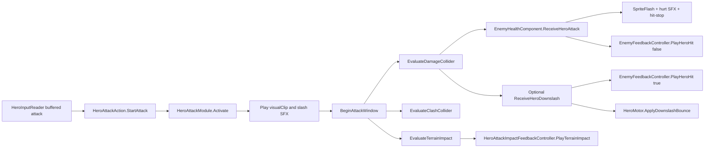
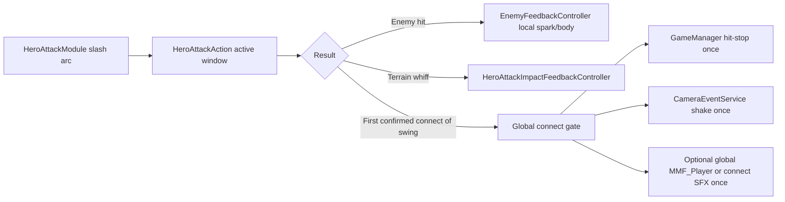

# Hollow Knight Slash VFX Integration for Metroidvania-Controller

> Stage 1 status note: the recommended hero-side first-confirmed-connect gate has been implemented. `HeroAttackAction` now owns generic attack-connect hit-stop and camera-shake requests; `EnemyHealthComponent` no longer triggers generic hit-stop per enemy.

## Executive summary

The strongest finding is that your repository is already much closer to a Hollow Knight-style combat-presentation stack than it may look at first glance. The project is on Unity 6000.3.10f1, depends on URP 17.3.0, and has a custom render pipeline assigned in `GraphicsSettings`, so the **primary implementation path should be URP-first**, not Built-in-first. More Mountains Feel is already in the project, and the camera layer already exposes a shake service that can use either `MMF_Player` presets or More Mountains camera-shake events. fileciteturn59file0 fileciteturn58file0 fileciteturn60file0 fileciteturn33file0 fileciteturn52file0

On the gameplay side, the current attack system already separates responsibilities in the right places. `HeroAttackModule` owns the authored directional slash object, its collider, its animated visual, and the startup slash SFX. `HeroAttackAction` owns attack timing, hit detection, downslash bounce, clash handling, and terrain-whiff impact routing. `EnemyHealthComponent` owns damage intake and currently triggers enemy-local hit feedback, hurt audio, and hit-stop; `EnemyFeedbackController` then plays the enemy spark/body/death `MMF_Player` sequences. `HeroAttackImpactFeedbackController` already exists and is specifically used for **terrain impact** feedbacks by direction. fileciteturn16file0 fileciteturn17file0 fileciteturn68file0 fileciteturn69file0 fileciteturn24file0 fileciteturn25file0 fileciteturn23file0

The uploaded `EnemyHitEffectsBlackKnight.cs` is, in fact, a **hit-VFX trigger script**. It does not detect hits on its own; instead, it waits for some external combat system to call `RecieveHitEffect(float attackDirection)`. When called, it fires a flash FSM event, plays a damage audio event, optionally triggers a sprite flash, instantiates an orange hit flash, instantiates a hit puff, rotates that puff by cardinal attack direction, and suppresses duplicate firing within the same frame. From a design perspective, it is clearly the same *kind* of role as your repo’s `EnemyFeedbackController`, but it belongs to a different architecture and depends on types and naming that are not repo-native, including `IHitEffectReciever`, `FSMUtility`, `AudioEvent`, `DirectionUtils`, and `flashInfected()`. In your repo, the closest equivalent path is `EnemyHealthComponent` → `EnemyFeedbackController`, not `IHitEffectReciever`. fileciteturn24file0 fileciteturn25file0 fileciteturn19file0

The best-fit recommendation for your project is therefore **not** a full rewrite to a brand-new VFX architecture. It is a **hybrid integration**: keep the existing directional `HeroAttackModule` slash visuals as the primary slash-arc owner, upgrade those visuals with Hollow Knight-style sprite/flipbook assets and better materials, continue to use `EnemyFeedbackController` and `HeroAttackImpactFeedbackController` for enemy/terrain accents, and add a **single hero-side “confirmed connect” feedback gate** so camera shake, hit-stop, and any global connect flourish happen once per swing rather than being driven separately by every enemy receiver. That recommendation fits the current repo architecture, the active URP setup, and the available Feel/Unity tooling. fileciteturn16file0 fileciteturn68file0 fileciteturn24file0 fileciteturn25file0 fileciteturn33file0 citeturn6view0turn5view0turn14view0turn15view0turn17view0

One limitation matters. I could not fetch the exact YouTube page for the specified tutorial in this session, so I could **not** verify the creator’s exact inspector values, material graph, or step-by-step narration directly from the video page. The “YouTube implementation” section below therefore distinguishes sharply between **high-confidence technical primitives** supported by Unity’s official documentation and **carefully labelled inferences** about how a Hollow Knight-style slash tutorial spanning URP and Built-in would most likely be assembled in practice. citeturn2view0turn2view2turn14view3turn15view0turn17view0

## Repository findings

### What the repo already has

The repo is not a blank canvas. It already contains nearly all of the extension points you need for slash VFX, hit VFX, terrain sparks, camera cues, and audio routing. It also shows some documentation drift: for example, the audio feature spec still says no audio system exists and describes `HeroAttackModule`’s audio field as technical debt, but the runtime code already has a working `AudioManager` and `HeroAttackModule.Activate()` already routes slash SFX through it. That means code, not old feature-spec prose, should be treated as the source of truth for this integration. fileciteturn53file0 fileciteturn38file0 fileciteturn16file0

| Path | Current role | Why it matters for Hollow Knight-style slash VFX |
|---|---|---|
| `ProjectSettings/ProjectVersion.txt` | Unity editor version `6000.3.10f1` | Confirms modern Unity 6 project; current editor/runtime assumptions should target that branch. fileciteturn59file0 |
| `Packages/manifest.json` | Includes `com.unity.render-pipelines.universal: 17.3.0` | Confirms URP is installed and should be treated as the primary target path. fileciteturn58file0 |
| `ProjectSettings/GraphicsSettings.asset` | `m_CustomRenderPipeline` is assigned | Confirms the active project is using a custom RP, not current Built-in. fileciteturn60file0 |
| `Assets/_Project/Scripts/Hero/Combat/HeroAttackModule.cs` | Owns directional slash visual, collider, Animancer clip, and slash startup SFX | Best existing home for the visible slash arc itself. fileciteturn16file0 fileciteturn17file0 |
| `Assets/_Project/Scripts/Hero/Actions/HeroAttackAction.cs` | Owns attack timing, damage/clash overlap, terrain impact checks, and downslash bounce | Best existing home for “when did a slash actually connect?”. fileciteturn68file0 fileciteturn69file0 fileciteturn70file0 |
| `Assets/_Project/Scripts/Enemy/EnemyHealthComponent.cs` | Applies damage, local flash, hurt/death audio, hit-stop, enemy hit feedback | Current enemy-hit flow entry point. fileciteturn24file0 |
| `Assets/_Project/Scripts/Enemy/Feedback/EnemyFeedbackController.cs` | Plays hit spark, pogo spark, body reaction, and death feedbacks via `MMF_Player` | Current repo-native enemy hit-presentation router. fileciteturn25file0 |
| `Assets/_Project/Scripts/Hero/Feedback/HeroAttackImpactFeedbackController.cs` | Plays side/up/down terrain impact feedbacks via `MMF_Player` | You already have a directional wall/floor/ceiling whiff VFX hook. fileciteturn23file0 |
| `Assets/_Project/Scripts/Camera/CameraShakeCueService.cs` | Central shake service, with optional `MMF_Player` presets and MM camera-shake fallback | You do not need to invent a second camera-shake system. fileciteturn33file0 fileciteturn52file0 |
| `Assets/_Project/Scripts/Audio/AudioManager.cs` | Central `PlaySFX` and `PlayMusic` router | Slash/hit SFX should continue to flow through this, not through random prefab-side audio sources. fileciteturn38file0 |

### How attack and hit flow currently works

The present flow is explicit and readable. `HeroAttackAction` starts attacks from buffered input, selects the directional `HeroAttackModule`, activates it, and then during the active window evaluates damage, clash, and terrain impact separately. On damage overlap it constructs a `HeroAttackHit`, calls `IHeroAttackReceiver.ReceiveHeroAttack(hit)`, optionally calls `IHeroDownslashResponder.ReceiveHeroDownslash(hit)`, and applies pogo bounce only once per downslash attack. Terrain impacts are already suppressed if the swing has hit an enemy, a clash receiver, or a pogo-valid downslash target. fileciteturn68file0 fileciteturn69file0 fileciteturn70file0



A short excerpt shows the important wiring:

```csharp
// HeroAttackAction
receiver.ReceiveHeroAttack(hit);
NotifyDownslashResponder(downslashResponder, hit);
TryApplyDownslashBounce(downslashResponder);

// EnemyHealthComponent
flasher?.FlashHit();
AudioManager.Instance?.PlaySFX(config.hurtSfx);
GameManager.Instance?.HitStop(config.hitStopDuration);
feedbackController?.PlayHeroHit(hit, false);
```

That is the key reason I recommend extending the current architecture rather than replacing it: the repo already has a clean distinction between **slash startup visuals** (`HeroAttackModule`), **authoritative combat timing** (`HeroAttackAction`), **enemy-local reactions** (`EnemyHealthComponent`/`EnemyFeedbackController`), and **terrain whiff impacts** (`HeroAttackImpactFeedbackController`). fileciteturn68file0 fileciteturn69file0 fileciteturn24file0 fileciteturn25file0 fileciteturn23file0

Two subtle technical consequences matter for polish. First, because `EnemyHealthComponent.ReceiveHeroAttack()` currently triggers `GameManager.HitStop(config.hitStopDuration)` directly, a multi-enemy swing can restart hit-stop from each receiver rather than enforcing a single global “first connect” punctuation. Second, `CameraShakeCueService` exposes world-position-aware signatures, but its current implementation ignores `worldPosition` and simply plays cues/presets; the camera feature spec also lists distance filtering for off-screen shake as future work. Those two facts are why a hero-side “first confirmed connect” gate is the cleanest next step. fileciteturn24file0 fileciteturn30file0 fileciteturn33file0 fileciteturn52file0

### Where the uploaded EnemyHitEffects script fits

The uploaded `EnemyHitEffectsBlackKnight.cs` is indeed a hit-VFX script, but it is **not the way your repo currently does this**.

A representative excerpt from the uploaded file is:

```csharp
public void RecieveHitEffect(float attackDirection)
{
    if (didFireThisFrame) return;

    FSMUtility.SendEventToGameObject(gameObject, "DAMAGE FLASH", true);
    enemyDamage.SpawnAndPlayOneShot(audioPlayerPrefab, transform.position);

    if (spriteFlash)
    {
        spriteFlash.flashInfected();
    }

    Instantiate(hitFlashOrange, transform.position + effectOrigin, Quaternion.identity);
    GameObject gameObject = Instantiate(hitPuffLarge, transform.position + effectOrigin, Quaternion.identity);

    switch (DirectionUtils.GetCardinalDirection(attackDirection))
    {
        case 0: gameObject.transform.eulerAngles = new Vector3(0f, 90f, 270f); break;
        case 1: gameObject.transform.eulerAngles = new Vector3(270f, 90f, 270f); break;
        case 2: gameObject.transform.eulerAngles = new Vector3(180f, 90f, 270f); break;
        case 3: gameObject.transform.eulerAngles = new Vector3(-72.5f, -180f, -180f); break;
    }

    didFireThisFrame = true;
}
```

So the answer to your question is: **yes, that script clearly causes hit VFX and hit SFX when called**. But it only does so when another system invokes `RecieveHitEffect(float attackDirection)`. It is therefore a **receiver/router**, not a detector or owner of combat truth.

For your repo, that matters because the active combat contract is different. Your attack system speaks in terms of `HeroAttackHit`, `IHeroAttackReceiver`, `IHeroDownslashResponder`, and `EnemyFeedbackController`; it does **not** speak in terms of `IHitEffectReciever`. The uploaded file also references dependencies that are not part of the repo code I inspected, and even its sprite-flash call does not match the repo’s current `SpriteFlash` API, which exposes `FlashHit()` and unscaled-time flashing via material property blocks. In other words: port the **effect intent**, not the class wholesale. fileciteturn19file0 fileciteturn20file0 fileciteturn24file0 fileciteturn25file0 fileciteturn65file0

## YouTube tutorial and render-pipeline implications

### What could be verified and what could not

I could not retrieve the specific YouTube page itself through the browser tool in this session, so I could not audit the exact tutorial transcript, frame timings, material graph, or inspector values directly from the video page. The analysis in this section therefore combines the tutorial’s stated scope with Unity’s official documentation for the underlying systems that a two-pipeline slash-VFX tutorial necessarily relies on. Where I infer likely implementation details, I call that out explicitly. citeturn2view0

### High-confidence technical takeaways

At a high confidence level, a Hollow Knight-style slash effect that works in both URP and Built-in will rest on a small number of Unity primitives:

1. **Animated particle or sprite frames**. Unity’s Particle System supports texture-sheet animation, including whole-sheet or single-row flipbooks, and lets playback be driven by lifetime, speed, or FPS. That is the standard way to drive a slash arc, hit flash, or impact burst from a sprite atlas. citeturn2view2

2. **Particle renderer configuration**. Unity’s Particle System renderer supports billboard and stretched-billboard rendering, material assignment, trail materials, sorting control, render alignment, and Sprite Mask interaction. Those are the relevant levers for getting a 2D slash to read crisply in front of characters and terrain. citeturn14view3turn18view0

3. **Per-pipeline material/shader differences**. In Built-in, Unity’s Standard Particle Shaders provide additive/subtractive/modulate rendering modes, colour modes, flip-book modes, soft particles, camera fading, and optional distortion. In URP, Shader Graph is supported and Unity’s 2D Sprite Lit Shader Graph path allows a sprite to react to 2D lights and normal maps; Unity explicitly notes that without that shader path, light sources do not affect sprites. citeturn17view0turn2view3turn15view0

4. **Trail or secondary accent layers**. Unity’s Trails module can add stationary trails or ribbons, control width and colour over trail length, and use lit or custom materials if needed. That is relevant to slash-smear or after-image layers. citeturn18view0

5. **Sub-emitter-based contact bursts are available if wanted**. Unity’s Sub Emitters module can spawn child particles on birth, collision, death, trigger, or manually. That is useful if you want a slash-arc particle to emit a smaller contact burst at a specific stage, though for your repo a code-routed impact is likely cleaner than particle-collision-driven truth. citeturn24view0

### What this most likely means for the tutorial’s implementation

The tutorial title strongly suggests that the **effect logic itself** is largely pipeline-agnostic, while the **material/shader layer** changes between URP and Built-in. In practical Unity terms, that usually means the sprite atlas, animation timing, particle bursts, sorting layers, and trail behaviour remain basically the same, while the material switches from a Built-in particle shader to a URP-compatible material or graph. That is an inference, but it is the most technically defensible one given Unity’s official separation between Particle System modules and render-pipeline-specific shader/material support. citeturn2view2turn14view3turn17view0turn2view3turn15view0

For your project, this has an important consequence: because the repo already uses `HeroAttackModule` with `SpriteRenderer` + `AnimationClip` + Animancer for slash visuals, you do **not** need to convert the visible slash arc into a particle system unless you specifically want particle-driven trails or a more procedural material. A Hollow Knight-style result can be reached either by:

- keeping the slash arc as a **sprite-animated one-shot** and using particles/MM Feel only for impacts and terrain whiffs, or
- replacing the visible arc with a **particle flipbook** or URP graph-driven slash material.

The first path is lower risk because it aligns with current repo structure. The second path offers more stylised control but increases material/pipeline complexity. fileciteturn16file0 fileciteturn17file0 citeturn2view2turn14view3turn17view0turn15view0

### URP and Built-in differences that actually matter

| Concern | URP path | Built-in path |
|---|---|---|
| Repo fit | Direct fit; URP is installed and active in this project. fileciteturn58file0 fileciteturn60file0 | Secondary/fallback path only; not the current project state. fileciteturn60file0 |
| Custom shader workflow | Shader Graph is officially supported in URP, and Unity provides 2D lit sprite graph guidance. citeturn2view3turn15view0 | Shader Graph is not the supported path described for Built-in; use Built-in particle/sprite shaders or hand-written shaders. citeturn2view3turn17view0 |
| Particle material baseline | URP-compatible particle/unlit material or graph; optional 2D light response if desired. citeturn15view0 | Standard Particle Shader with additive/flip-book options is the obvious baseline. citeturn17view0 |
| Feel compatibility | Feel works in URP, but some post-processing feedbacks differ by RP. citeturn4view3turn4view4 | Feel works out of the box in BiRP; post-processing uses the Built-in post-processing stack. citeturn4view3turn4view4 |

My practical reading is simple: for **your repo**, treat URP as the production target and Built-in as a portability annex. fileciteturn58file0 fileciteturn60file0

## Relevant More Mountains Feel hooks

Feel is already conceptually aligned with the way your repo is structured. The official docs describe `MMF_Player` as the main container you call from code or UnityEvents, and the core-concepts examples show that you can initialise a player and then call `PlayFeedbacks()` or `PlayFeedbacks(position, intensity)` when an event occurs. That positional overload is exactly what you want for hit-point sparks and slash-on-wall effects. citeturn3view0turn6view0turn20view2

The most relevant Feel features for your integration are these:

- **`MMF_Player` as a code-triggered container** for one-shot feedback sequences, already used in your repo’s enemy and terrain controllers. fileciteturn25file0 fileciteturn23file0 citeturn3view0turn6view0
- **Per-player timing controls**, including initial delay, cooldown, duration multipliers, time-scale settings, and `CanPlayWhileAlreadyPlaying`. These are useful for avoiding duplicate hit sparks or for intentionally offsetting minor accent feedbacks after the main slash. citeturn3view0turn20view0
- **Shakers and channels**, which are Feel’s pattern for event-broadcasted effects. This maps well to camera or shared world-space presentation if you decide to expand beyond direct point playback later. citeturn20view3
- **Camera shake feedbacks**, with More Mountains recommending Cinemachine impulse for Cinemachine scenes, but also supporting regular camera shake via `MMCameraShaker` and a camera-rig structure. In your repo, this matters mainly as background knowledge, because `CameraShakeCueService` already abstracts away the camera implementation details. citeturn4view0turn20view5 fileciteturn33file0 fileciteturn52file0
- **Particles Instantiation / Particles Play**, which are the most directly relevant feedback types for slash contact sparks or mini-burst accents. citeturn20view4
- **Sound / AudioSource feedbacks**, which can be useful, but in your repo I would still prefer gameplay SFX to remain routed through `AudioManager` for consistency. Feel’s own “Sound” feedback can work in event or cached mode, but your architecture already has a central audio router. citeturn20view6 fileciteturn38file0

A short mapping from Feel to your repo looks like this:

| Need | Best hook in your repo | Relevant Feel feature |
|---|---|---|
| Enemy hit spark at hit point | `EnemyFeedbackController.PlayHeroHit` | `MMF_Player.PlayFeedbacks(worldPosition)` and particle feedbacks. fileciteturn25file0 citeturn20view2turn20view4 |
| Terrain whiff spark | `HeroAttackImpactFeedbackController.PlayTerrainImpact` | Direction-specific `MMF_Player` instances already fit this exactly. fileciteturn23file0 citeturn3view0 |
| Camera shake | `CameraEventService` / `CameraShakeCueService` | Optional `MMF_Player` presets or MM camera-shake events. fileciteturn32file0 fileciteturn33file0 fileciteturn52file0 |
| Global impact timing | Hero-side connect gate in `HeroAttackAction` | `MMF_Player` timing, delays, and anti-overlap controls. fileciteturn68file0 citeturn20view0 |
| Audio accent | `AudioManager` | Keep code-routed unless you deliberately want a pure Feel-owned local accent. fileciteturn38file0 citeturn20view6 |

The key architectural point is that you do **not** need to make Feel authoritative over combat. Your project is already better structured than that. Let code continue to decide **when** a slash hit, clashed, pogoed, or whiffed, and let Feel handle only **how that event is presented**. fileciteturn68file0 fileciteturn69file0 citeturn6view0turn3view0

## Recommended integration plan

### Recommended target architecture

The lowest-risk and highest-value target for this repo is:

- **Slash arc** owned by `HeroAttackModule`
- **Authoritative contact timing** owned by `HeroAttackAction`
- **Enemy-local body/contact/death reactions** owned by `EnemyFeedbackController`
- **Terrain whiff sparks** owned by `HeroAttackImpactFeedbackController`
- **One-per-swing global punctuation** owned by a new hero-side or global connect gate, not by enemy receivers

That produces a clean split between local and global feedback, and it matches the repo’s current architecture very well. fileciteturn16file0 fileciteturn68file0 fileciteturn24file0 fileciteturn25file0 fileciteturn23file0



### Required assets and authoring decisions

You will need a small but deliberate asset set. The details of the exact art are still yours to choose, but the project-side implications are clear.

| Asset or authoring item | Minimum recommendation | Decision needed |
|---|---|---|
| Slash arc art | One one-shot arc for side, up, and down; either sprite-flipbook or particle flipbook | Do you want the visible slash to stay sprite-based or become particle-based? |
| Hit spark atlas | Small, high-contrast white/orange slash-contact burst | Reuse same atlas for enemy and terrain, or split styles? |
| Enemy body reaction | Flash, tiny scale punch, or body hit feedback in `EnemyFeedbackController` | Keep current MMF-only route or add bespoke enemy families later? |
| Audio | Slash whoosh, connect tick/crack, hurt/death clips | Add a hero-side connect SFX or keep only startup/hurt/death? |
| URP materials | Sprite Unlit or URP graph for slash arc; URP-compatible particle material | Should the slash react to 2D lights? |
| Built-in materials | Standard Particle Shader additive/flip-book variant | Do you actually need Built-in portability now, or later? |

Given the repo state, my default answer would be: **keep the visible slash arc sprite-based first**, because `HeroAttackModule` already supports an activated `SpriteRenderer` + `AnimationClip` flow; add particles only for connect/whiff accents; then add a custom URP slash material only if the art direction still feels short of target. fileciteturn16file0 fileciteturn17file0

### Step-by-step implementation path

1. **Do not move combat truth out of `HeroAttackAction`.**  
   Keep `HeroAttackAction` responsible for deciding when the slash connected, clashed, pogoed, or hit terrain. That preserves the existing one-per-swing receiver dedupe and current terrain suppression rules. fileciteturn68file0 fileciteturn69file0

2. **Upgrade the visible slash arc inside `HeroAttackModule`.**  
   Replace or improve the current `visualClip`/`SpriteRenderer` assets with Hollow Knight-style arcs. If your first goal is “match the game feel fast”, this is the fastest route because no combat code changes are needed just to improve the visible swipe. `HeroAttackModule.Activate()` already turns the visual on, plays the clip, and triggers the slash SFX. fileciteturn16file0 fileciteturn17file0

3. **Add a hero-side “first confirmed connect” gate.**  
   Introduce a new boolean in `HeroAttackAction`, for example `connectFeedbackPlayedThisSwing`. On the first enemy hit or clash of a swing, trigger:
   - hit-stop once,
   - camera shake once,
   - optional connect SFX once,
   - optional global connect `MMF_Player` once.  
   Leave enemy-local contact/body/death reactions on `EnemyFeedbackController`. This avoids over-punctuating multi-hit swings and keeps enemy-local flavour separate from global impact punctuation. fileciteturn24file0 fileciteturn25file0 fileciteturn30file0 fileciteturn32file0 fileciteturn33file0

   A minimal sketch would look like:

   ```csharp
   private bool connectFeedbackPlayedThisSwing;

   private void TriggerConnectFeel(HeroAttackHit hit, bool isClash)
   {
       if (connectFeedbackPlayedThisSwing) return;
       connectFeedbackPlayedThisSwing = true;

       GameManager.Instance?.HitStop(isClash ? config.attackClashHitStopDuration
                                             : config.attackHitStopDuration);

       CameraEventService.RequestShake(CameraShakeIntensity.Small, hit.Point, 1f, owner);

       attackConnectFeedback?.PlayFeedbacks(
           new Vector3(hit.Point.x, hit.Point.y, 0f),
           1f
       );

       AudioManager.Instance?.PlaySFX(config.attackConnectSfx);
   }
   ```

   To support that cleanly, add these fields to `HeroConfig`:
   - `float attackHitStopDuration`
   - `float attackClashHitStopDuration`
   - `AudioClip attackConnectSfx`
   - optional `CameraShakeIntensity` or `CameraShakeProfile attackHitShake`

4. **Keep terrain whiff logic where it already is.**  
   You already have `HeroAttackImpactFeedbackController` and `HeroAttackAction.EvaluateTerrainImpact()`. Unless you have a specific problem with the current terrain spark path, do not rewrite it. Instead, make sure the assigned `MMF_Player`s use the art style and timing you want. The current implementation is good: it picks side/up/down feedbacks, suppresses duplicates, uses `ClosestPoint()`, and raycasts when already inside geometry. fileciteturn23file0 fileciteturn69file0

5. **Do not port `EnemyHitEffectsBlackKnight.cs` as-is.**  
   If you like the *look* of its `hitFlashOrange` + `hitPuffLarge` combo, port those prefabs and reproduce the behaviour inside either:
   - `EnemyFeedbackController`, using `MMF_Player` and/or particle-instantiation feedbacks, or
   - a new repo-native adapter called by `EnemyFeedbackController`.  
   Do **not** introduce `IHitEffectReciever` and the rest of that external dependency chain into this repo unless you are intentionally migrating the whole combat/presentation architecture.

6. **URP branch**  
   For URP, you have two good choices:
   - **Fastest/lowest risk**: Sprite-Unlit-style slash material plus regular particles for impacts.
   - **Higher polish**: custom URP graph for the slash, optionally using a lit sprite graph if you want 2D lights and normal-map response.  
   Unity’s docs are explicit that Shader Graph is supported in URP and that 2D lit sprite graphs are the way to make sprites react to 2D lights. citeturn2view3turn15view0

   A practical URP stack for you would be:
   - slash arc: animated sprite material on `HeroAttackModule`
   - impact sparks: particle systems using flipbook animation
   - body reaction: `MMF_Player` in `EnemyFeedbackController`
   - camera: existing `CameraShakeCueService`

7. **Built-in branch**  
   If you need a Built-in-compatible version later, keep the same authored atlases and timing, but replace URP-only shader/material choices with Built-in-friendly ones:
   - Standard Particle Shader in **Additive** mode for bright slash/spark layers
   - Built-in flip-book mode for smoother atlas playback
   - optional soft particles/camera fading only if justified by your scene and budget.  
   The Built-in particle shader docs explicitly support additive style blending and flip-book modes, which makes this path workable without changing the effect logic. citeturn17view0

### Why I recommend sprite-first rather than particle-first for this repo

The repo already models the slash as a directional authored object with a renderer and one-shot animation clip. That is already a good fit for a Hollow Knight-style swipe silhouette. A particle-first rewrite would give you more procedural control, but it would also force you to relocate visual ownership away from the place the repo already expects it to live. In other words, **sprite-first is the architecture-compatible choice; particle-first is the effects-experimentation choice**. fileciteturn16file0 fileciteturn17file0 fileciteturn40file0

## Alternatives, trade-offs, and validation

### Option comparison

| Approach | Strengths | Weaknesses | Best fit |
|---|---|---|---|
| **Keep current sprite-animated slash arc, improve art/materials, add MMF/particles for impacts** | Lowest code risk; aligns with `HeroAttackModule`; fastest to ship | Less procedural than a full particle/graph solution | **Best default for this repo** |
| **Particle-system slash arc + particle sparks + MMF body/camera** | Very flexible for smear, trails, and burst accents; portable across URP/Built-in with material swaps | More authoring complexity; can fight current module ownership model | Good if you want richer procedural slash shapes |
| **URP Shader Graph slash arc + particle or MMF accents** | Best polish ceiling in URP; can support 2D lights and stylised masks | URP-specific, less portable, more shader maintenance | Good if art direction demands a premium URP look |
| **Directly port uploaded `EnemyHitEffectsBlackKnight` pattern** | Reuses a look you already like | Dependency mismatch; non-native interfaces; would duplicate existing repo responsibilities | **Not recommended as a direct port** |
| **Sub-emitter-heavy particle setup** | Strong layered impact bursts | Harder to keep authoritative; easier to duplicate accidentally | Better for VFX polish than for gameplay truth routing |

The basic trade-off is simple: the further you move toward particles and custom shaders, the more expressive the effect becomes, but the more you fight a repo that already has a clear slash-visual container and clear hit-presentation routers. For this project, that cost is not justified unless the simpler hybrid pass still feels visually insufficient. fileciteturn16file0 fileciteturn25file0 citeturn2view2turn14view3turn17view0turn24view0

### Validation checklist

A good validation pass should prove both **wiring correctness** and **feel correctness**.

- **Side slash into enemy**: visible arc appears on the correct module, enemy hit spark/body reaction play, connect punctuation happens once, no terrain whiff spark appears on the same swing. fileciteturn16file0 fileciteturn69file0 fileciteturn24file0 fileciteturn25file0
- **Up slash into ceiling**: ceiling terrain-impact feedback fires exactly once, positioned at the best contact point. fileciteturn23file0 fileciteturn69file0
- **Down slash on enemy**: normal enemy hit feedback occurs, pogo spark path occurs, and bounce occurs only once per attack. No terrain spark should fire on the same successful pogo swing. fileciteturn24file0 fileciteturn25file0 fileciteturn69file0 fileciteturn46file0
- **Whiff into wall/floor**: only terrain-feedback route fires, once per swing. fileciteturn23file0 fileciteturn69file0
- **Two enemies in one swing**: both enemies may still receive local hit reactions, but global hit-stop/shake should not stack repeatedly if you implement the hero-side gate.
- **Hit-stop timing**: sprite flashes should still read properly during hit-stop. The repo’s `SpriteFlash` already uses unscaled-time waits and property blocks, which is a good baseline; any new animated feedback should be tested for scaled vs unscaled behaviour explicitly. fileciteturn65file0 citeturn3view0
- **Camera**: on-screen impacts feel crisp; off-screen hits do not become noisy if you later introduce world-distance filtering. The current feature spec flags that as a future concern. fileciteturn52file0
- **URP materials**: slash arc and particles sort correctly with sprites, lights, and transparency.
- **Built-in fallback**: additive flip-book materials still read correctly without URP graphs. citeturn17view0

### Estimated effort and risk

Assuming the current repo state from the connector is representative, and assuming art assets are either already available or can be authored quickly, the work looks like this:

| Workstream | Estimated effort | Risk | Notes |
|---|---:|---|---|
| Improve slash arc inside current `HeroAttackModule` | 0.5–1.5 days | Low | Mostly art/material hookup |
| Add hero-side first-connect gate for hit-stop/shake/SFX | 0.5–1 day | Low–medium | Small code change, high feel payoff |
| Tune enemy/local MMF players and terrain impact players | 0.5–1.5 days | Low | Mostly authoring and iteration |
| URP material/shader polish pass | 1–3 days | Medium | Depends on whether you stay unlit or go Shader Graph |
| Built-in-compatible fallback materials | 0.5–1.5 days | Medium | Separate materials, some duplicate testing |
| Direct port of uploaded `EnemyHitEffectsBlackKnight` logic | 1–3 days | High | Dependency mismatch and architecture drift |

My overall estimate for the **recommended hybrid path** is **2–5 developer days**, plus whatever art time is needed to produce slash/spark atlases and audio that are close enough to your target. The largest technical risk is not code complexity; it is **presentation duplication** from mixing enemy-local feedback, terrain whiff feedback, and global hit punctuation without a single “first confirmed connect” gate. fileciteturn24file0 fileciteturn25file0 fileciteturn69file0 fileciteturn30file0

## Effort, risk, and limitations

The most important limitation is source access. The specified YouTube page could not be fetched directly in this session, so I could not verify the tutorial’s exact implementation details from the page itself. Where I described “the YouTube implementation”, I grounded the analysis in official Unity documentation for particle, shader, and render-pipeline capabilities and labelled the missing parts as inference rather than fact. citeturn2view0turn2view2turn14view3turn15view0turn17view0

There is also a repo-state limitation. The uploaded `EnemyHitEffectsBlackKnight.cs` was inspected locally, but I did not find a connector-visible `EnemyHitEffects` class in the GitHub repo itself. So the uploaded file should be treated as **external reference code you want to learn from**, not as established repo wiring. The connector-visible enemy-hit path is still `EnemyHealthComponent` plus `EnemyFeedbackController`. fileciteturn24file0 fileciteturn25file0

Finally, there is a design limitation you should decide intentionally: because the repo is already active on URP, every hour spent making a dual URP/Built-in solution is an hour not spent improving the actual shipped path. Unless you know you will truly need Built-in portability soon, I would implement the effect **URP-first**, keep art assets pipeline-agnostic where possible, and then add Built-in material variants only after the URP version already feels right. fileciteturn58file0 fileciteturn60file0 citeturn4view3turn17view0
